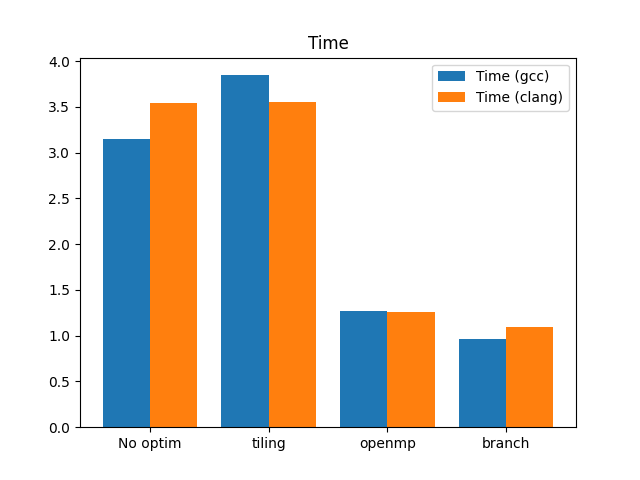
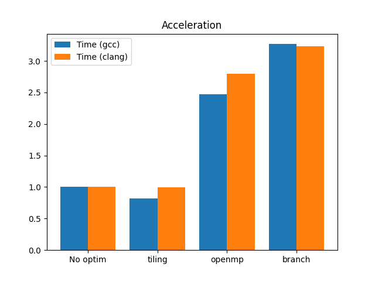
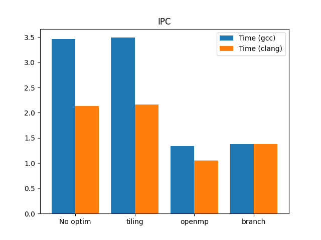
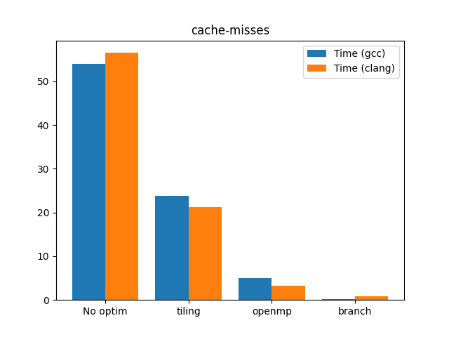

# ВВЕДЕНИЕ

Цель:
Изучить основные методы оптимизации кода.

Задача:
В данной лабораторной работе необходимо реализовать алгоритм Флойда-Уоршалла. После этого оптимизировать код.

# Подготовка

Все замеры будут проводиться на следующей системе:

``` bash
CPU: i7-8750H 12x 4.1GHz

CPU-flags: fpu vme de pse tsc msr pae mce cx8 apic sep mtrr pge mca cmov pat pse36 clflush dts acpi mmx fxsr sse sse2 ss ht tm pbe syscall nx pdpe1gb rdtscp lm constant_tsc art arch_perfmon pebs bts rep_good nopl xtopology nonstop_tsc cpuid aperfmperf pni pclmulqdq dtes64 monitor ds_cpl vmx est tm2 ssse3 sdbg fma cx16 xtpr pdcm pcid sse4_1 sse4_2 x2apic movbe popcnt tsc_deadline_timer aes xsave avx f16c rdrand lahf_lm abm 3dnowprefetch cpuid_fault epb invpcid_single pti ssbd ibrs ibpb stibp tpr_shadow vnmi flexpriority ept vpid ept_ad fsgsbase tsc_adjust bmi1 avx2 smep bmi2 erms invpcid mpx rdseed adx smap clflushopt intel_pt xsaveopt xsavec xgetbv1 xsaves dtherm ida arat pln pts hwp hwp_notify hwp_act_window hwp_epp md_clear flush_l1d

RAM: DDR4 16Gb 
OC: GNU/Linux, archlinux, kernel 6.2.8-arch1-1
Компиляторы: gcc (12.2.1), clang (15.0.7)

```

# 1. Изначальный вариант алгоритма Флойда

Получилась следующая реализация:

``` c
void test_func()
{
    int i, j, k;
    for (k = 0; k < n; k++)
    {
        for (i = 0; i < n; i++)
        {
            for (j = 0; j < n; j++)
            {
                if (matrix[i][k] + matrix[k][j] < matrix[i][j])
                {
                    matrix[i][j] = matrix[i][k] + matrix[k][j];
                }
            }
        }
    }
}
```

Сейчас и в дальнейшем размерность матрицы A будет 1024x1024

Компиляция:

``` bash
> CC -O0 -Wall -lm main1.c -o main1
```

Исходный код программы `main1.c` представлен в приложении.

Программа выводит отбрабатывает результаты и выводит статистики.

Обработка происходит следующим образом:
- Предварительно проводим разогрев (и проверяем корректность (сравнивая с наивной реализацией, для собственно наивной релизации этого не проводится))
- Проводим 100 измерений.
- Находим и отбрасываем промахи измерений при помощи квартилей (25% минимальных и максимальных)
- Вычисляем оценку математического ожидания
- Вычисляем медиану
- Вычисляем несмещенную оценку дисперсии
- Вычисляем стандартное отклонение
- Вычисляем стандартную ошибку среднего времени отклонения
- Вычисляем относительную стандартную ошибку среднего (RSE)
- Строим доверительные интервалы.

RSE показывает на сколько близко вычисленное среднее время выполнения к истинному среднему времени выполнения (среднему генеральной совокупности)

Вывод программы:

``` bash
> ./main1_1
# GCC:
# CPU time:
# droped 51 items
# mean: 3.146197
# median: 3.084153
# std_dev: 0.113523
# std_err: 0.016218
# rel_std_err: 0.515467
# t = mean +- 3*var = 3.146197 +- 0.038663

# Real time:
# droped 51 items
# mean: 3.151042
# median: 3.089124
# std_dev: 0.114038
# std_err: 0.016291
# rel_std_err: 0.517009
# t = mean +- 3*var = 3.151042 +- 0.039014

# CLANG:
# CPU time:
# droped 51 items
# mean: 3.529559
# median: 3.535751
# std_dev: 0.046781
# std_err: 0.006683
# rel_std_err: 0.189344
# t = mean +- 3*var = 3.529559 +- 0.006565

# Real time:
# droped 51 items
# mean: 3.536036
# median: 3.541838
# std_dev: 0.047109
# std_err: 0.006730
# rel_std_err: 0.190323
# t = mean +- 3*var = 3.536036 +- 0.006658

```

Так же запустим более облегченную версию, без подсчета статистик, чтоб просмотреть хотспоты.

Смотрим, что говорит профайлер:

``` bash
> perf record ./main1_light
> perf report

```

Смотрим метрики:

``` bash
> perf stat -B -e task-clock,context-switches,cpu-migrations,cycles,instructions,cache-references,cache-misses,branches,branch-misses,migrations,page-faults ./main1_light
#  Performance counter stats for CLANG
#        6511.29 msec task-clock:u                     #    1.000 CPUs utilized
#              0      context-switches:u               #    0.000 /sec
#              0      cpu-migrations:u                 #    0.000 /sec
#    23578587586      cycles:u                         #    3.621 GHz                         (66.64%)
#    50158590531      instructions:u                   #    2.13  insn per cycle              (83.32%)
#      284036503      cache-references:u               #   43.622 M/sec                       (83.32%)
#      160558400      cache-misses:u                   #   56.527 % of all cache refs         (83.33%)
#     8629780438      branches:u                       #    1.325 G/sec                       (83.37%)
#       35843502      branch-misses:u                  #    0.42% of all branches             (83.34%)
#              0      migrations:u                     #    0.000 /sec
#           1090      page-faults:u                    #  167.402 /sec

#  Performance counter stats for GCC
#        6402.17 msec task-clock:u                     #    0.996 CPUs utilized
#              0      context-switches:u               #    0.000 /sec
#              0      cpu-migrations:u                 #    0.000 /sec
#    24609235710      cycles:u                         #    3.844 GHz                         (66.69%)
#    85190493279      instructions:u                   #    3.46  insn per cycle              (83.32%)
#      285230106      cache-references:u               #   44.552 M/sec                       (83.28%)
#      153966856      cache-misses:u                   #   53.980 % of all cache refs         (83.33%)
#     4324659580      branches:u                       #  675.499 M/sec                       (83.32%)
#       35932997      branch-misses:u                  #    0.83% of all branches             (83.39%)
#              0      migrations:u                     #    0.000 /sec
#           1091      page-faults:u                    #  170.411 /sec
```

В качестве метрик будут использоваться: 

- время выполнения программы: Время в секундах выполнения.

- instructions: IPC (instructions per second).

- cache-misses: Миссы по кэшу.

Сведём в таблицу:

|       | время    | IPC          | cache-misses |
|-------|----------|--------------|--------------|
| gcc   | 3.151042 | 3.46         | 53.980       |
| clang | 3.536036 | 2.13         | 56.527       |


В данном случае компиляции perf выявил одни из самых "долгих" операций (строчки не последовательны):

| CPU percent | Команда                         |
|-------------|---------------------------------|
| 9.21        |  mov    (%rax),%eax             |
| 5.54        |  mov    (%rax), %edx            |


Довольно много процессорного времени занимает обращение к памяти.

Попробуем уменьшить обращения к памяти.

# 2. Оптимизация кода с помощью тайлинга

Попробуем разбить код на тайлы. В теории это должно уменьшить промахи по кэшу и оптимизировать доступ к памяти:

``` cpp
void FW(int **A, int K, int I, int J, int N)
{
     int i,j,k;

     for(k=K; k<K+N; k++)
        for(i=I; i<I+N; i++)
           for(j=J; j<J+N; j++)
                if (A[i][k] + A[k][j] < A[i][j])
                    A[i][j] = A[i][k] + A[k][j];

}

void test_func()
{
    int i, j, k;

    for(k=0;k<n;k+=B)
    {
        FW(matrix,k,k,k,B);

        for(i=0; i<k; i+=B)
            FW(matrix,k,i,k,B);

        for(i=k+B; i<n; i+=B)
            FW(matrix,k,i,k,B);

        for(j=0; j<k; j+=B)
            FW(matrix,k,k,j,B);

        for(j=k+B; j<n; j+=B)
            FW(matrix,k,k,j,B);

        for(i=0; i<k; i+=B)
            for(j=0; j<k; j+=B)
                FW(matrix,k,i,j,B);

        for(i=0; i<k; i+=B)
            for(j=k+B; j<n; j+=B)
                FW(matrix,k,i,j,B);

        for(i=k+B; i<n; i+=B)
            for(j=0; j<k; j+=B)
                FW(matrix,k,i,j,B);

        for(i=k+B; i<n; i+=B)
            for(j=k+B; j<n; j+=B)
                FW(matrix,k,i,j,B);
    }
}

```

Компилируем:

``` bash
> CC -Wall -O0 -lm main2.c -o main2
```

Исходный код программы `main1_2.c` представлен в приложении.

Размер тайла - 32 (наиболее оптимальный по тестам)

Сделаем замеры:

``` bash
> ./main2
# GCC:
# CPU time:
# droped 51 items
# mean: 3.839508
# median: 3.837676
# std_dev: 0.027141
# std_err: 0.003877
# rel_std_err: 0.100985
# t = mean +- 3*var = 3.839508 +- 0.002210

# Real time:
# droped 51 items
# mean: 3.845146
# median: 3.844900
# std_dev: 0.027237
# std_err: 0.003891
# rel_std_err: 0.101191

# CLANG:
# CPU time:
# droped 51 items
# mean: 3.550961
# median: 3.530671
# std_dev: 0.064703
# std_err: 0.009243
# rel_std_err: 0.260303
# t = mean +- 3*var = 3.550961 +- 0.012559

# Real time:
# droped 51 items
# mean: 3.555679
# median: 3.535507
# std_dev: 0.065115
# std_err: 0.009302
# rel_std_err: 0.261615
# t = mean +- 3*var = 3.555679 +- 0.012720

```

``` bash
> perf stat -B -e task-clock,context-switches,cpu-migrations,cycles,instructions,cache-references,cache-misses,branches,branch-misses,migrations,page-faults ./main2_light
#  Performance counter stats for CLANG
#        6841.45 msec task-clock:u                     #    1.000 CPUs utilized
#              0      context-switches:u               #    0.000 /sec
#              0      cpu-migrations:u                 #    0.000 /sec
#    26705690345      cycles:u                         #    3.904 GHz                         (66.67%)
#    57727096028      instructions:u                   #    2.16  insn per cycle              (83.34%)
#       61414959      cache-references:u               #    8.977 M/sec                       (83.34%)
#       13050076      cache-misses:u                   #   21.249 % of all cache refs         (83.34%)
#     8898533580      branches:u                       #    1.301 G/sec                       (83.34%)
#      103411767      branch-misses:u                  #    1.16% of all branches             (83.31%)
#              0      migrations:u                     #    0.000 /sec
#           1091      page-faults:u                    #  159.469 /sec

#  Performance counter stats for GCC
#        7098.21 msec task-clock:u                     #    0.999 CPUs utilized
#              0      context-switches:u               #    0.000 /sec
#              0      cpu-migrations:u                 #    0.000 /sec
#    26559787257      cycles:u                         #    3.742 GHz                         (66.63%)
#    92565614425      instructions:u                   #    3.49  insn per cycle              (83.33%)
#       62886690      cache-references:u               #    8.860 M/sec                       (83.35%)
#       14928952      cache-misses:u                   #   23.739 % of all cache refs         (83.35%)
#     4529625705      branches:u                       #  638.136 M/sec                       (83.35%)
#       49975582      branch-misses:u                  #    1.10% of all branches             (83.32%)
#              0      migrations:u                     #    0.000 /sec
#           1090      page-faults:u                    #  153.560 /sec

```

Сведём в таблицу:

|       | время    | IPC          | cache-misses |
|-------|----------|--------------|--------------|
| gcc   | 3.845146 | 3.49         | 23.739       |
| clang | 3.555679 | 2.16         | 21.249       |

Видим, что cache-misses относительно cache refs уменьшились, но прям существенного прироста по времени это не дало.

Однако, данный код довольно просто распараллелить. Попробуем это сделать.

# 3. Оптимизация кода с помощью openmp


``` cpp
void FW(int **A, int K, int I, int J, int N)
{
     int i,j,k;

     for(k=K; k<K+N; k++)
        for(i=I; i<I+N; i++)
           for(j=J; j<J+N; j++)
                if (A[i][k] + A[k][j] < A[i][j])
                    A[i][j] = A[i][k] + A[k][j];

}

void test_func()
{
    int i, j, k;

    for(k=0;k<n;k+=B)
    {
        FW(matrix,k,k,k,B);

        #pragma omp parallel for
        for(i=0; i<k; i+=B)
            FW(matrix,k,i,k,B);
        #pragma omp parallel for
        for(i=k+B; i<n; i+=B)
            FW(matrix,k,i,k,B);
        #pragma omp parallel for
        for(j=0; j<k; j+=B)
            FW(matrix,k,k,j,B);
        #pragma omp parallel for
        for(j=k+B; j<n; j+=B)
            FW(matrix,k,k,j,B);
        #pragma omp parallel for private(j)
        for(i=0; i<k; i+=B)
            for(j=0; j<k; j+=B)
                FW(matrix,k,i,j,B);
        #pragma omp parallel for private(j)
        for(i=0; i<k; i+=B)
            for(j=k+B; j<n; j+=B)
                FW(matrix,k,i,j,B);
            #pragma omp parallel for private(j)
        for(i=k+B; i<n; i+=B)
            for(j=0; j<k; j+=B)
                FW(matrix,k,i,j,B);
        #pragma omp parallel for private(j)
        for(i=k+B; i<n; i+=B)
            for(j=k+B; j<n; j+=B)
                FW(matrix,k,i,j,B);
    }
}
```

Компилируем:

``` bash
> CC -Wall -O0 -lm -fopenmp main2.c -o main2
```

Исходный код программы `main2.c` представлен в приложении.

Сделаем замеры:

``` bash
> ./main2
# GCC
# CPU time:
# droped 51 items
# mean: 15.206396
# median: 15.186590
# std_dev: 0.077700
# std_err: 0.011100
# rel_std_err: 0.072996
# t = mean +- 3*var = 15.206396 +- 0.018112

# Real time:
# droped 51 items
# mean: 1.272879
# median: 1.271084
# std_dev: 0.007941
# std_err: 0.001134
# rel_std_err: 0.089125
# t = mean +- 3*var = 1.272879 +- 0.000189

# CLANG
# CPU time:
# droped 51 items
# mean: 15.091893
# median: 15.102260
# std_dev: 0.061966
# std_err: 0.008852
# rel_std_err: 0.058656
# t = mean +- 3*var = 15.091893 +- 0.011519

# Real time:
# droped 51 items
# mean: 1.262614
# median: 1.262369
# std_dev: 0.006426
# std_err: 0.000918
# rel_std_err: 0.072701
# t = mean +- 3*var = 1.262614 +- 0.000124
```

Вот что perf говорит:

``` bash
> perf stat -B -e task-clock,context-switches,cpu-migrations,cycles,instructions,cache-references,cache-misses,branches,branch-misses,migrations,page-faults ./main2_light
#  Performance counter stats for CLANG
#       20263.66 msec task-clock:u                     #   11.665 CPUs utilized
#              0      context-switches:u               #    0.000 /sec
#              0      cpu-migrations:u                 #    0.000 /sec
#    67374992663      cycles:u                         #    3.325 GHz                         (66.85%)
#    93401916334      instructions:u                   #    1.39  insn per cycle              (83.46%)
#      128775058      cache-references:u               #    6.355 M/sec                       (83.25%)
#        4196635      cache-misses:u                   #    3.259 % of all cache refs         (83.40%)
#     4782660870      branches:u                       #  236.022 M/sec                       (83.24%)
#       51341104      branch-misses:u                  #    1.07% of all branches             (83.26%)
#              0      migrations:u                     #    0.000 /sec
#           1128      page-faults:u                    #   55.666 /sec

#  Performance counter stats for GCC
#       20303.45 msec task-clock:u                     #   11.597 CPUs utilized
#              0      context-switches:u               #    0.000 /sec
#              0      cpu-migrations:u                 #    0.000 /sec
#    68508291128      cycles:u                         #    3.374 GHz                         (66.59%)
#    93703446385      instructions:u                   #    1.37  insn per cycle              (83.30%)
#      140579144      cache-references:u               #    6.924 M/sec                       (83.46%)
#        6948347      cache-misses:u                   #    4.943 % of all cache refs         (83.33%)
#     4800401373      branches:u                       #  236.433 M/sec                       (83.43%)
#       50661029      branch-misses:u                  #    1.06% of all branches             (83.28%)
#              0      migrations:u                     #    0.000 /sec
#           1128      page-faults:u                    #   55.557 /sec
```

Сведём в таблицу:

|       | время     | IPC          | cache-misses |
|-------|-----------|--------------|--------------|
| gcc   | 1.272879  | 1.34         |  4.943       |
| clang | 1.262614  | 1.05         |  3.259       |


Видим, что время существенно уменьшилось. 


# 4. Оптимизация ветвлений

Попробуем оптимизировать ветвления в программе

``` cpp

void FW(int **A, int K, int I, int J, int N)
{
     int i,j,k;

     for(k=K; k<K+N; k++)
        for(i=I; i<I+N; i++)
           for(j=J; j<J+N; j++)
           {
                int buff = A[i][k] + A[k][j];
                if (likely(buff < A[i][j]))
                    A[i][j] = buff;
           }

}

void test_func()
{
    int i, j, k;

    for(k=0;k<n;k+=B)
    {
        FW(matrix,k,k,k,B);

        #pragma omp parallel for
        for(i=0; i<k; i+=B)
            FW(matrix,k,i,k,B);
        #pragma omp parallel for
        for(i=k+B; i<n; i+=B)
            FW(matrix,k,i,k,B);
        #pragma omp parallel for
        for(j=0; j<k; j+=B)
            FW(matrix,k,k,j,B);
        #pragma omp parallel for
        for(j=k+B; j<n; j+=B)
            FW(matrix,k,k,j,B);
        #pragma omp parallel for private(j)
        for(i=0; i<k; i+=B)
            for(j=0; j<k; j+=B)
                FW(matrix,k,i,j,B);
        #pragma omp parallel for private(j)
        for(i=0; i<k; i+=B)
            for(j=k+B; j<n; j+=B)
                FW(matrix,k,i,j,B);
        #pragma omp parallel for private(j)
        for(i=k+B; i<n; i+=B)
            for(j=0; j<k; j+=B)
                FW(matrix,k,i,j,B);
        #pragma omp parallel for private(j)
        for(i=k+B; i<n; i+=B)
            for(j=k+B; j<n; j+=B)
                FW(matrix,k,i,j,B);
    }
}

```

Компилируем:

``` bash
> CC -O0 -Wall -fopenmp main3.c -o main3
```

Исходный код программы `main3` представлен в приложении.

Сделаем замеры:

``` bash
> ./main3
# GCC:
# CPU time:
# droped 51 items
# mean: 10.299493
# median: 10.374548
# std_dev: 0.232114
# std_err: 0.033159
# rel_std_err: 0.293457
# t = mean +- 3*var = 10.299493 +- 0.161631

# Real time:
# droped 51 items
# mean: 0.964160
# median: 0.971035
# std_dev: 0.019940
# std_err: 0.002849
# rel_std_err: 0.295441
# t = mean +- 3*var = 0.964160 +- 0.001193

# CLANG:
# CPU time:
# droped 51 items
# mean: 10.379031
# median: 10.357564
# std_dev: 0.619982
# std_err: 0.088569
# rel_std_err: 0.715474
# t = mean +- 3*var = 10.379031 +- 1.153132

# Real time:
# droped 51 items
# mean: 1.094300
# median: 1.095385
# std_dev: 0.067027
# std_err: 0.009575
# rel_std_err: 0.875012
# t = mean +- 3*var = 1.094300 +- 0.013478

```

``` bash
> perf stat -B -e task-clock,context-switches,cpu-migrations,cycles,instructions,cache-references,cache-misses,branches,branch-misses,migrations,page-faults ./main3_light
#  Performance counter stats for CLANG
#       32547.13 msec task-clock:u                     #   11.905 CPUs utilized
#              0      context-switches:u               #    0.000 /sec
#              0      cpu-migrations:u                 #    0.000 /sec
#    73288137714      cycles:u                         #    2.252 GHz                         (66.69%)
#   101229596077      instructions:u                   #    1.38  insn per cycle              (83.35%)
#       97763307      cache-references:u               #    3.004 M/sec                       (83.38%)
#         823906      cache-misses:u                   #    0.843 % of all cache refs         (83.35%)
#     4781673272      branches:u                       #  146.915 M/sec                       (83.31%)
#       48976950      branch-misses:u                  #    1.02% of all branches             (83.32%)
#              0      migrations:u                     #    0.000 /sec
#           1123      page-faults:u                    #   34.504 /sec

#  Performance counter stats for GCC
#       32318.39 msec task-clock:u                     #   11.937 CPUs utilized
#              0      context-switches:u               #    0.000 /sec
#              0      cpu-migrations:u                 #    0.000 /sec
#    72958041403      cycles:u                         #    2.257 GHz                         (66.65%)
#   101044039060      instructions:u                   #    1.38  insn per cycle              (83.35%)
#      134023461      cache-references:u               #    4.147 M/sec                       (83.40%)
#         335949      cache-misses:u                   #    0.251 % of all cache refs         (83.33%)
#     4781758553      branches:u                       #  147.958 M/sec                       (83.32%)
#       49088780      branch-misses:u                  #    1.03% of all branches             (83.30%)
#              0      migrations:u                     #    0.000 /sec
#           1123      page-faults:u                    #   34.748 /sec

```


|       | время      | IPC          | cache-misses |
|-------|------------|--------------|--------------|
| gcc   |0.964160    |   1.38       |  0.251       |
| clang |1.094300    |   1.38       |  0.843       |


Получили уменьшение времени работы, пропуски по кешу практически не поменялись, а IPC стало чуть выше у clang.


# Графики

Сделаем общую таблицу.

|                 | время, с | IPC  | cache-misses, % | Компилятор |
|-----------------|----------|------|-----------------|------------|
| Без оптимизаций | 3.151042 | 3.46         | 53.980       | gcc        |
| tiling          | 3.845146 | 3.49         | 23.739       | gcc        |
| openmp          | 1.272879   | 1.34         |  4.943       | gcc        |
| branch          | 0.964160   |  1.38       |   0.251       | gcc        |
| Без оптимизаций  | 3.536036 | 2.13         | 56.527       |clang      |
| tiling          | 3.555679 | 2.16         | 21.249       | clang      |
| openmp          | 1.262614  | 1.05         |  3.259       | clang      |
| branch          | 1.094300   |  1.38        |  0.843      | clang      |


График зависимости времени выполнения от этапа оптимизации:



По графику видно, что оптимизация кода, осущевстлённая в данной лабораторной работе не была напрасной, она дала прирост производительности.

График зависимости ускорения от этапа оптимизации:



График зависимости IPC от этапа оптимизации:



График зависимости cache-misses от этапа оптимизации:




# Выводы

Анализируя график зависимости времени выполнения и ускорения можно сделать вывод о том, что компиляторы по разному компилируют код. Но в целом по графику видно, что оптимизация по времени успешна.

В однопоточной реализации блокинг не улучшает результаты. Возможно, процессор хорошо делает предвыборку, поэтому не дает прироста в скорости выполнения.

Оптимизация ветвлений так же дала небольшой рост производительности, так как мы позволили компилятору оптимизировать код таким образом, чтоб быстрее выполнялась наиболее часто получаемая ветка.

График кэш-миссов от этапа оптимизации к этапу либо именьшается, либо остаётся почти неизменным. Про кэш-миссы в случае многопоточности нужно отметить, что каждый поток берёт блок итераций, поэтому ему в сумме меньше нужно загружать данные в кэш, а потому в общем поток будет меньше промахиваться.

# ПРИЛОЖЕНИЕ

Листинг `main1.c`:

``` cpp
// naive floyd warshall implementation
#include <stdio.h>
#include <stdlib.h>
#include <sys/time.h>
#include <math.h>
#include <assert.h>
// #include <immintrin.h> // avx
// #include <omp.h>
#include <time.h>

#define n 1024
#define B 32

#define INF 999999999

int **matrix;

void test_func()
{
    int i, j, k;
    for (k = 0; k < n; k++)
    {
        for (i = 0; i < n; i++)
        {
            for (j = 0; j < n; j++)
            {
                if (matrix[i][k] + matrix[k][j] < matrix[i][j])
                {
                    matrix[i][j] = matrix[i][k] + matrix[k][j];
                }
            }
        }
    }
}

void print_statistics(float *measures, int m)
{
    // drop outliers with quartiles
    float q1 = 0, q3 = 0;
    for(int i = 0; i < m; i++)
    {
        for(int j = i + 1; j < m; j++)
        {
            if(measures[i] > measures[j])
            {
                float tmp = measures[i];
                measures[i] = measures[j];
                measures[j] = tmp;
            }
        }
    }
    q1 = measures[m / 4];
    q3 = measures[3 * m / 4];
    int k = 0;
    for(int i = 0; i < m; i++)
    {
        if(measures[i] > q1 && measures[i] < q3)
        {
            measures[k] = measures[i];
            k++;
        }
    }
    
    printf("droped %d items \n", m-k);
    m = k;

    // calculate mean value
    float mean = 0;
    for(int i = 0; i < m; i++)
        mean += measures[i];
    mean /= m;

    // calculate median value
    float median = 0;
    if(m % 2 == 0)
        median = (measures[m / 2] + measures[m / 2 - 1]) / 2;
    else
        median = measures[m / 2];

    // calculate unbiased sample variance
    float var = 0;
    for(int i = 0; i < m; i++)
        var += (measures[i] - mean) * (measures[i] - mean);
    var /= (m - 1);
    
    // calculate standard deviation
    float std_dev = sqrt(var);

    // calculate standard error
    float std_err = std_dev / sqrt(m);

    // calculate relative standart error
    float rel_std_err = (std_err / mean) * 100;

    printf("mean: %f \nmedian: %f \nstd_dev: %f \nstd_err: %f \nrel_std_err: %f\n", mean, median, std_dev, std_err, rel_std_err);

    printf("t = mean +- 3*var = %f +- %f\n", mean, 3*var);
}


void graph_init_random()
{
     unsigned int i, j;

     srand48(5051);
     for(i=0; i<n; i++)
        for(j=0; j<n; j++)
        {   
            if(i == j)
                matrix[i][j] = INF;
            else
                matrix[i][j] = abs(((int)lrand48()) % 1048576);
        }
}


int main()
{
    
    int i;
    matrix = (int **)malloc(n*sizeof(int *));
    for(i = 0; i < n; i++)
        matrix[i] = (int *)malloc(n*sizeof(int));

    graph_init_random();

    // initialize the matrix
    int m = 100;

    // warmup
    test_func();

    clock_t begin_cpu, end_cpu;
    struct timeval begin_time, end_time;

    // m-iterations
    float measures_real[m];
    float measures_cpu[m];

    for(int i = 0; i < m; i++)
    {
        graph_init_random();
        gettimeofday(&begin_time, NULL);
        begin_cpu = clock();
        test_func();
        end_cpu = clock();
        gettimeofday(&end_time, NULL);

        long time_seconds = end_time.tv_sec - begin_time.tv_sec;
        long time_microseconds = end_time.tv_usec - begin_time.tv_usec;
        double time_elapsed = time_seconds + time_microseconds*1e-6;
        // long time_elapsed_mcs = (long)(time_elapsed*1000000 + 0.5);

        double cputime_spent = (double)(end_cpu - begin_cpu) / CLOCKS_PER_SEC;
        // long cputime_spent_mcs = (long)(cputime_spent*1000000 + 0.5);

        measures_cpu[i] = cputime_spent;
        measures_real[i] = time_elapsed;
    }
    
    puts("CPU time:");
    print_statistics((float *)measures_cpu, m);
    puts("Real time:");
    print_statistics((float *)measures_real, m);
    
    for(i = 0; i < n; i++)
        free(matrix[i]);

    free(matrix);

    return 0;
}

```

Листинг `main2.c`:

``` cpp
// naive floyd warshall implementation
#include <stdio.h>
#include <stdlib.h>
#include <sys/time.h>
#include <math.h>
#include <assert.h>
// #include <immintrin.h> // avx
// #include <omp.h>
#include <time.h>

#define n 1024
#define B 32

#define INF 999999999

int **matrix;

void FW(int **A, int K, int I, int J, int N)
{
     int i,j,k;

     for(k=K; k<K+N; k++)
        for(i=I; i<I+N; i++)
           for(j=J; j<J+N; j++)
                if (A[i][k] + A[k][j] < A[i][j])
                    A[i][j] = A[i][k] + A[k][j];

}

void test_func()
{
    int i, j, k;

    for(k=0;k<n;k+=B)
    {
        FW(matrix,k,k,k,B);

        #pragma omp parallel for
        for(i=0; i<k; i+=B)
            FW(matrix,k,i,k,B);
        #pragma omp parallel for
        for(i=k+B; i<n; i+=B)
            FW(matrix,k,i,k,B);
        #pragma omp parallel for
        for(j=0; j<k; j+=B)
            FW(matrix,k,k,j,B);
        #pragma omp parallel for
        for(j=k+B; j<n; j+=B)
            FW(matrix,k,k,j,B);
        #pragma omp parallel for private(j)
        for(i=0; i<k; i+=B)
            for(j=0; j<k; j+=B)
                FW(matrix,k,i,j,B);
        #pragma omp parallel for private(j)
        for(i=0; i<k; i+=B)
            for(j=k+B; j<n; j+=B)
                FW(matrix,k,i,j,B);
        #pragma omp parallel for private(j)
        for(i=k+B; i<n; i+=B)
            for(j=0; j<k; j+=B)
                FW(matrix,k,i,j,B);
        #pragma omp parallel for private(j)
        for(i=k+B; i<n; i+=B)
            for(j=k+B; j<n; j+=B)
                FW(matrix,k,i,j,B);
    }
}

void print_statistics(float *measures, int m)
{
    // drop outliers with quartiles
    float q1 = 0, q3 = 0;
    for(int i = 0; i < m; i++)
    {
        for(int j = i + 1; j < m; j++)
        {
            if(measures[i] > measures[j])
            {
                float tmp = measures[i];
                measures[i] = measures[j];
                measures[j] = tmp;
            }
        }
    }
    q1 = measures[m / 4];
    q3 = measures[3 * m / 4];
    int k = 0;
    for(int i = 0; i < m; i++)
    {
        if(measures[i] > q1 && measures[i] < q3)
        {
            measures[k] = measures[i];
            k++;
        }
    }
    
    printf("droped %d items \n", m-k);
    m = k;

    // calculate mean value
    float mean = 0;
    for(int i = 0; i < m; i++)
        mean += measures[i];
    mean /= m;

    // calculate median value
    float median = 0;
    if(m % 2 == 0)
        median = (measures[m / 2] + measures[m / 2 - 1]) / 2;
    else
        median = measures[m / 2];

    // calculate unbiased sample variance
    float var = 0;
    for(int i = 0; i < m; i++)
        var += (measures[i] - mean) * (measures[i] - mean);
    var /= (m - 1);
    
    // calculate standard deviation
    float std_dev = sqrt(var);

    // calculate standard error
    float std_err = std_dev / sqrt(m);

    // calculate relative standart error
    float rel_std_err = (std_err / mean) * 100;

    printf("mean: %f \nmedian: %f \nstd_dev: %f \nstd_err: %f \nrel_std_err: %f\n", mean, median, std_dev, std_err, rel_std_err);

    printf("t = mean +- 3*var = %f +- %f\n", mean, 3*var);
}


void graph_init_random()
{
     unsigned int i, j;

     srand48(5051);
     for(i=0; i<n; i++)
        for(j=0; j<n; j++)
        {   
            if(i == j)
                matrix[i][j] = INF;
            else
                matrix[i][j] = abs(((int)lrand48()) % 1048576);
        }
}


int main()
{
    
    int i;
    matrix = (int **)malloc(n*sizeof(int *));
    for(i = 0; i < n; i++)
        matrix[i] = (int *)malloc(n*sizeof(int));

    graph_init_random();

    // initialize the matrix
    int m = 100;

    // warmup
    test_func();

    clock_t begin_cpu, end_cpu;
    struct timeval begin_time, end_time;

    // m-iterations
    float measures_real[m];
    float measures_cpu[m];

    for(int i = 0; i < m; i++)
    {
        graph_init_random();
        gettimeofday(&begin_time, NULL);
        begin_cpu = clock();
        test_func();
        end_cpu = clock();
        gettimeofday(&end_time, NULL);

        long time_seconds = end_time.tv_sec - begin_time.tv_sec;
        long time_microseconds = end_time.tv_usec - begin_time.tv_usec;
        double time_elapsed = time_seconds + time_microseconds*1e-6;
        // long time_elapsed_mcs = (long)(time_elapsed*1000000 + 0.5);

        double cputime_spent = (double)(end_cpu - begin_cpu) / CLOCKS_PER_SEC;
        // long cputime_spent_mcs = (long)(cputime_spent*1000000 + 0.5);

        measures_cpu[i] = cputime_spent;
        measures_real[i] = time_elapsed;
    }
    
    puts("CPU time:");
    print_statistics((float *)measures_cpu, m);
    puts("Real time:");
    print_statistics((float *)measures_real, m);
    
    for(i = 0; i < n; i++)
        free(matrix[i]);

    free(matrix);

    return 0;
}
```

Листинг `main3.c`:

``` cpp
#include <stdio.h>
#include <stdlib.h>
#include <sys/time.h>
#include <math.h>
#include <assert.h>
#include <time.h>

#define likely(x) __builtin_expect(!!(x), 1)
#define unlikely(x) __builtin_expect(!!(x), 0)

#define n 1024
#define B 32

#define INF 999999999

int **matrix;

void FW(int **A, int K, int I, int J, int N)
{
     int i,j,k;

     for(k=K; k<K+N; k++)
        for(i=I; i<I+N; i++)
           for(j=J; j<J+N; j++)
           {
                int buff = A[i][k] + A[k][j];
                if (likely(buff < A[i][j]))
                    A[i][j] = buff;
           }

}

void test_func()
{
    int i, j, k;

    for(k=0;k<n;k+=B)
    {
        FW(matrix,k,k,k,B);

        #pragma omp parallel for
        for(i=0; i<k; i+=B)
            FW(matrix,k,i,k,B);
        #pragma omp parallel for
        for(i=k+B; i<n; i+=B)
            FW(matrix,k,i,k,B);
        #pragma omp parallel for
        for(j=0; j<k; j+=B)
            FW(matrix,k,k,j,B);
        #pragma omp parallel for
        for(j=k+B; j<n; j+=B)
            FW(matrix,k,k,j,B);
        #pragma omp parallel for private(j)
        for(i=0; i<k; i+=B)
            for(j=0; j<k; j+=B)
                FW(matrix,k,i,j,B);
        #pragma omp parallel for private(j)
        for(i=0; i<k; i+=B)
            for(j=k+B; j<n; j+=B)
                FW(matrix,k,i,j,B);
        #pragma omp parallel for private(j)
        for(i=k+B; i<n; i+=B)
            for(j=0; j<k; j+=B)
                FW(matrix,k,i,j,B);
        #pragma omp parallel for private(j)
        for(i=k+B; i<n; i+=B)
            for(j=k+B; j<n; j+=B)
                FW(matrix,k,i,j,B);
    }
}

void print_statistics(float *measures, int m)
{
    // drop outliers with quartiles
    float q1 = 0, q3 = 0;
    for(int i = 0; i < m; i++)
    {
        for(int j = i + 1; j < m; j++)
        {
            if(measures[i] > measures[j])
            {
                float tmp = measures[i];
                measures[i] = measures[j];
                measures[j] = tmp;
            }
        }
    }
    q1 = measures[m / 4];
    q3 = measures[3 * m / 4];
    int k = 0;
    for(int i = 0; i < m; i++)
    {
        if(measures[i] > q1 && measures[i] < q3)
        {
            measures[k] = measures[i];
            k++;
        }
    }
    
    printf("droped %d items \n", m-k);
    m = k;

    // calculate mean value
    float mean = 0;
    for(int i = 0; i < m; i++)
        mean += measures[i];
    mean /= m;

    // calculate median value
    float median = 0;
    if(m % 2 == 0)
        median = (measures[m / 2] + measures[m / 2 - 1]) / 2;
    else
        median = measures[m / 2];

    // calculate unbiased sample variance
    float var = 0;
    for(int i = 0; i < m; i++)
        var += (measures[i] - mean) * (measures[i] - mean);
    var /= (m - 1);
    
    // calculate standard deviation
    float std_dev = sqrt(var);

    // calculate standard error
    float std_err = std_dev / sqrt(m);

    // calculate relative standart error
    float rel_std_err = (std_err / mean) * 100;

    printf("mean: %f \nmedian: %f \nstd_dev: %f \nstd_err: %f \nrel_std_err: %f\n", mean, median, std_dev, std_err, rel_std_err);

    printf("t = mean +- 3*var = %f +- %f\n", mean, 3*var);
}


void graph_init_random()
{
     unsigned int i, j;

     srand48(5051);
     for(i=0; i<n; i++)
        for(j=0; j<n; j++)
        {   
            if(i == j)
                matrix[i][j] = INF;
            else
                matrix[i][j] = abs(((int)lrand48()) % 1048576);
        }
}


int main()
{
    
    int i;
    matrix = (int **)malloc(n*sizeof(int *));
    for(i = 0; i < n; i++)
        matrix[i] = (int *)malloc(n*sizeof(int));

    graph_init_random();

    // initialize the matrix
    int m = 100;

    // warmup
    test_func();

    clock_t begin_cpu, end_cpu;
    struct timeval begin_time, end_time;

    // m-iterations
    float measures_real[m];
    float measures_cpu[m];

    for(int i = 0; i < m; i++)
    {
        graph_init_random();
        gettimeofday(&begin_time, NULL);
        begin_cpu = clock();
        test_func();
        end_cpu = clock();
        gettimeofday(&end_time, NULL);

        long time_seconds = end_time.tv_sec - begin_time.tv_sec;
        long time_microseconds = end_time.tv_usec - begin_time.tv_usec;
        double time_elapsed = time_seconds + time_microseconds*1e-6;
        // long time_elapsed_mcs = (long)(time_elapsed*1000000 + 0.5);

        double cputime_spent = (double)(end_cpu - begin_cpu) / CLOCKS_PER_SEC;
        // long cputime_spent_mcs = (long)(cputime_spent*1000000 + 0.5);

        measures_cpu[i] = cputime_spent;
        measures_real[i] = time_elapsed;
    }
    
    puts("CPU time:");
    print_statistics((float *)measures_cpu, m);
    puts("Real time:");
    print_statistics((float *)measures_real, m);
    
    for(i = 0; i < n; i++)
        free(matrix[i]);

    free(matrix);

    return 0;
}

```

Листинг `main1_light.c`:

``` cpp
// naive floyd warshall implementation
#include <stdio.h>
#include <stdlib.h>
#include <sys/time.h>
#include <assert.h>
// #include <immintrin.h> // avx
// #include <omp.h>
#include <time.h>

#define n 1024
#define B 32

#define INF 999999999

int **matrix;

void test_func()
{
    int i, j, k;
    for (k = 0; k < n; k++)
    {
        for (i = 0; i < n; i++)
        {
            for (j = 0; j < n; j++)
            {
                if (matrix[i][k] + matrix[k][j] < matrix[i][j])
                {
                    matrix[i][j] = matrix[i][k] + matrix[k][j];
                }
            }
        }
    }
}

void graph_init_random()
{
     unsigned int i, j;

     srand48(5051);
     for(i=0; i<n; i++)
        for(j=0; j<n; j++)
        {   
            if(i == j)
                matrix[i][j] = INF;
            else
                matrix[i][j] = abs(((int)lrand48()) % 1048576);
        }
}


int main()
{
    
    int i;
    matrix = (int **)malloc(n*sizeof(int *));
    for(i = 0; i < n; i++)
        matrix[i] = (int *)malloc(n*sizeof(int));

    graph_init_random();
    // warmup
    test_func();
    graph_init_random();
    test_func();
    
    for(i = 0; i < n; i++)
        free(matrix[i]);

    free(matrix);

    return 0;
}
```

Листинг `main2_light.c`:

``` cpp
// naive floyd warshall implementation
#include <stdio.h>
#include <stdlib.h>
#include <sys/time.h>
#include <assert.h>
// #include <immintrin.h> // avx
// #include <omp.h>
#include <time.h>

#define n 1024
#define B 32

#define INF 999999999

int **matrix;

void FW(int **A, int K, int I, int J, int N)
{
     int i,j,k;

     for(k=K; k<K+N; k++)
        for(i=I; i<I+N; i++)
           for(j=J; j<J+N; j++)
                if (A[i][k] + A[k][j] < A[i][j])
                    A[i][j] = A[i][k] + A[k][j];

}

void test_func()
{
    int i, j, k;

    for(k=0;k<n;k+=B)
    {
        FW(matrix,k,k,k,B);

        #pragma omp parallel for
        for(i=0; i<k; i+=B)
            FW(matrix,k,i,k,B);
        #pragma omp parallel for
        for(i=k+B; i<n; i+=B)
            FW(matrix,k,i,k,B);
        #pragma omp parallel for
        for(j=0; j<k; j+=B)
            FW(matrix,k,k,j,B);
        #pragma omp parallel for
        for(j=k+B; j<n; j+=B)
            FW(matrix,k,k,j,B);
        #pragma omp parallel for private(j)
        for(i=0; i<k; i+=B)
            for(j=0; j<k; j+=B)
                FW(matrix,k,i,j,B);
        #pragma omp parallel for private(j)
        for(i=0; i<k; i+=B)
            for(j=k+B; j<n; j+=B)
                FW(matrix,k,i,j,B);
            #pragma omp parallel for private(j)
        for(i=k+B; i<n; i+=B)
            for(j=0; j<k; j+=B)
                FW(matrix,k,i,j,B);
        #pragma omp parallel for private(j)
        for(i=k+B; i<n; i+=B)
            for(j=k+B; j<n; j+=B)
                FW(matrix,k,i,j,B);
    }
}


void graph_init_random()
{
     unsigned int i, j;

     srand48(5051);
     for(i=0; i<n; i++)
        for(j=0; j<n; j++)
        {   
            if(i == j)
                matrix[i][j] = INF;
            else
                matrix[i][j] = abs(((int)lrand48()) % 1048576);
        }
}


int main()
{
    
    int i;
    matrix = (int **)malloc(n*sizeof(int *));
    for(i = 0; i < n; i++)
        matrix[i] = (int *)malloc(n*sizeof(int));

    graph_init_random();
    // warmup
    test_func();
    graph_init_random();
    test_func();
    
    for(i = 0; i < n; i++)
        free(matrix[i]);

    free(matrix);

    return 0;
}
```

Листинг `main3_light.c`:

``` cpp
// naive floyd warshall implementation
#include <stdio.h>
#include <stdlib.h>
#include <sys/time.h>
#include <assert.h>
// #include <immintrin.h> // avx
// #include <omp.h>
#include <time.h>

#define n 1024
#define B 32

#define likely(x) __builtin_expect(!!(x), 1)
#define unlikely(x) __builtin_expect(!!(x), 0)

#define INF 999999999

int **matrix;

void FW(int **A, int K, int I, int J, int N)
{
     int i,j,k;

     for(k=K; k<K+N; k++)
        for(i=I; i<I+N; i++)
           for(j=J; j<J+N; j++)
           {
                int buff = A[i][k] + A[k][j];
                if (likely(buff < A[i][j]))
                    A[i][j] = buff;
           }

}

void test_func()
{
    int i, j, k;

    for(k=0;k<n;k+=B)
    {
        FW(matrix,k,k,k,B);

        #pragma omp parallel for
        for(i=0; i<k; i+=B)
            FW(matrix,k,i,k,B);
        #pragma omp parallel for
        for(i=k+B; i<n; i+=B)
            FW(matrix,k,i,k,B);
        #pragma omp parallel for
        for(j=0; j<k; j+=B)
            FW(matrix,k,k,j,B);
        #pragma omp parallel for
        for(j=k+B; j<n; j+=B)
            FW(matrix,k,k,j,B);
        #pragma omp parallel for private(j)
        for(i=0; i<k; i+=B)
            for(j=0; j<k; j+=B)
                FW(matrix,k,i,j,B);
        #pragma omp parallel for private(j)
        for(i=0; i<k; i+=B)
            for(j=k+B; j<n; j+=B)
                FW(matrix,k,i,j,B);
        #pragma omp parallel for private(j)
        for(i=k+B; i<n; i+=B)
            for(j=0; j<k; j+=B)
                FW(matrix,k,i,j,B);
        #pragma omp parallel for private(j)
        for(i=k+B; i<n; i+=B)
            for(j=k+B; j<n; j+=B)
                FW(matrix,k,i,j,B);
    }
}


void graph_init_random()
{
     unsigned int i, j;

     srand48(5051);
     for(i=0; i<n; i++)
        for(j=0; j<n; j++)
        {   
            if(i == j)
                matrix[i][j] = INF;
            else
                matrix[i][j] = abs(((int)lrand48()) % 1048576);
        }
}


int main()
{
    
    int i;
    matrix = (int **)malloc(n*sizeof(int *));
    for(i = 0; i < n; i++)
        matrix[i] = (int *)malloc(n*sizeof(int));

    graph_init_random();
    // warmup
    test_func();
    graph_init_random();
    test_func();
    
    for(i = 0; i < n; i++)
        free(matrix[i]);

    free(matrix);

    return 0;
}
```