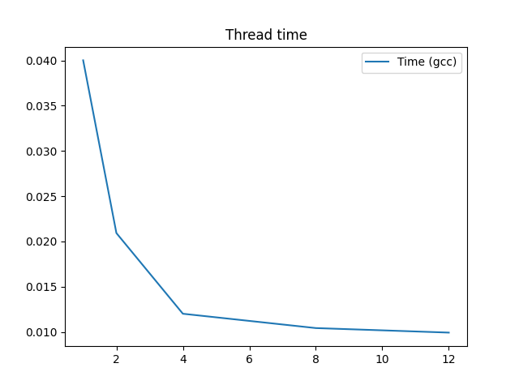

# ВВЕДЕНИЕ

Цель:
Изучить основные методы оптимизации кода.

Задача:
В данной лабораторной работе необходимо реализовать алгоритм умножения матрицы на вектор. После этого оптимизировать код.

# Подготовка

Все замеры будут проводиться на следующей системе:

``` bash
CPU: i7-8750H 12x 4.1GHz

CPU-flags: fpu vme de pse tsc msr pae mce cx8 apic sep mtrr pge mca cmov pat pse36 clflush dts acpi mmx fxsr sse sse2 ss ht tm pbe syscall nx pdpe1gb rdtscp lm constant_tsc art arch_perfmon pebs bts rep_good nopl xtopology nonstop_tsc cpuid aperfmperf pni pclmulqdq dtes64 monitor ds_cpl vmx est tm2 ssse3 sdbg fma cx16 xtpr pdcm pcid sse4_1 sse4_2 x2apic movbe popcnt tsc_deadline_timer aes xsave avx f16c rdrand lahf_lm abm 3dnowprefetch cpuid_fault epb invpcid_single pti ssbd ibrs ibpb stibp tpr_shadow vnmi flexpriority ept vpid ept_ad fsgsbase tsc_adjust bmi1 avx2 smep bmi2 erms invpcid mpx rdseed adx smap clflushopt intel_pt xsaveopt xsavec xgetbv1 xsaves dtherm ida arat pln pts hwp hwp_notify hwp_act_window hwp_epp md_clear flush_l1d

RAM: DDR4 16Gb 
OC: GNU/Linux, archlinux, kernel 6.2.8-arch1-1
Компиляторы: gcc (12.2.1), clang (15.0.7)

```

# 1. Изначальный вариант умножения матрицы на вектор

Получилась следующая реализация:

``` c
void test_func()
{
    for(int i = 0; i < n; i++)
        for (int j = 0; j < n; j++)
            result[i] += matrix[i][j] * vector[j];
}

```

Сейчас и в дальнейшем размерность матрицы A будет 8192x8192, вектора соответственно 8192x1

Компиляция:

``` bash
> CC -O0 -Wall -lm main1.c -o main1
```

Исходный код программы `main1.c` представлен в приложении.

Программа выводит отбрабатывает результаты и выводит статистики.

Обработка происходит следующим образом:
- Предварительно проводим разогрев (и проверяем корректность (сравнивая с наивной реализацией, для собственно наивной релизации этого не проводится))
- Проводим 100 измерений.
- Находим и отбрасываем промахи измерений при помощи квартилей (25% минимальных и максимальных)
- Вычисляем оценку математического ожидания
- Вычисляем медиану
- Вычисляем несмещенную оценку дисперсии
- Вычисляем стандартное отклонение
- Вычисляем стандартную ошибку среднего времени отклонения
- Вычисляем относительную стандартную ошибку среднего (RSE)
- Строим доверительные интервалы.

RSE показывает на сколько близко вычисленное среднее время выполнения к истинному среднему времени выполнения (среднему генеральной совокупности)

Вывод программы:

``` bash
> ./main1_1
# GCC:
# CPU time:
# droped 51 items
# mean: 0.164176
# median: 0.163794
# std_dev: 0.000928
# std_err: 0.000133
# rel_std_err: 0.080739
# t = mean +- 3*var = 0.164176 +- 0.000003

# Real time:
# droped 51 items
# mean: 0.164468
# median: 0.164061
# std_dev: 0.000953
# std_err: 0.000136
# rel_std_err: 0.082735
# t = mean +- 3*var = 0.164468 +- 0.000003


# CLANG:
# CPU time:
# droped 51 items
# mean: 0.161353
# median: 0.161347
# std_dev: 0.000194
# std_err: 0.000028
# rel_std_err: 0.017167
# t = mean +- 3*var = 0.161353 +- 0.000000

# Real time:
# droped 51 items
# mean: 0.161525
# median: 0.161504
# std_dev: 0.000194
# std_err: 0.000028
# rel_std_err: 0.017127
# t = mean +- 3*var = 0.161525 +- 0.000000
```

Так же запустим более облегченную версию, без подсчета статистик, чтоб просмотреть хотспоты.

Смотрим, что говорит профайлер:

``` bash
> perf record ./main1_light
> perf report
# Samples: 5K of event 'cycles:u', Event count (approx.): 5067091968
# Overhead  Command      Shared Object         Symbol
#   55.03%  main1_light  libc.so.6             [.] random
#   25.03%  main1_light  main1_light           [.] test_func
#    9.60%  main1_light  libc.so.6             [.] random_r 
#    5.16%  main1_light  main1_light           [.] main
#    3.42%  main1_light  libc.so.6             [.] rand
#    1.17%  main1_light  main1_light           [.] rand@plt
```

Смотрим метрики:

``` bash
> perf stat -B -e task-clock,context-switches,cpu-migrations,cycles,instructions,cache-references,cache-misses,branches,branch-misses,migrations,page-faults ./main1_light
#  Performance counter stats for CLANG
#        1409.64 msec task-clock:u                     #    0.999 CPUs utilized
#              0      context-switches:u               #    0.000 /sec
#              0      cpu-migrations:u                 #    0.000 /sec
#     5050282640      cycles:u                         #    3.583 GHz                         (66.41%)
#     7789093782      instructions:u                   #    1.54  insn per cycle              (83.21%)
#       22715883      cache-references:u               #   16.115 M/sec                       (83.38%)
#       14361301      cache-misses:u                   #   63.221 % of all cache refs         (83.41%)
#     1468819406      branches:u                       #    1.042 G/sec                       (83.41%)
#        3951456      branch-misses:u                  #    0.27% of all branches             (83.39%)
#              0      migrations:u                     #    0.000 /sec
#          40572      page-faults:u                    #   28.782 K/sec

#    1.411236624 seconds time elapsed

#    1.355476000 seconds user
#    0.049946000 seconds sys

#  Performance counter stats for GCC
#        1467.89 msec task-clock:u                     #    0.999 CPUs utilized
#              0      context-switches:u               #    0.000 /sec
#              0      cpu-migrations:u                 #    0.000 /sec
#     5149268756      cycles:u                         #    3.508 GHz                         (66.49%)
#     8800488876      instructions:u                   #    1.71  insn per cycle              (83.25%)
#       20964705      cache-references:u               #   14.282 M/sec                       (83.24%)
#       13726477      cache-misses:u                   #   65.474 % of all cache refs         (83.43%)
#     1268035043      branches:u                       #  863.849 M/sec                       (83.45%)
#        5435067      branch-misses:u                  #    0.43% of all branches             (83.39%)
#              0      migrations:u                     #    0.000 /sec
#          54879      page-faults:u                    #   37.386 K/sec

#    1.469238674 seconds time elapsed

#    1.404207000 seconds user
#    0.059763000 seconds sys

```

В качестве метрик будут использоваться: 

- время выполнения программы: Время в секундах выполнения.

- instructions: IPC (instructions per second).

- cache-misses: Миссы по кэшу.

Сведём в таблицу:

|       | время    | IPC          | cache-misses |
|-------|----------|--------------|--------------|
| gcc   | 0.164468 | 1.71         | 65.474       |
| clang | 0.161525 | 1.54         | 63.221       |

В данном случае компиляции perf выявил одни из самых "долгих" операций (строчки не последовательны):

|  CPU percent   |          Команда                |
|----------------|---------------------------------|
| 10.47          |      movss  (%rdx,%rax,1),%xmm1 |
| 11.10          |      movslq %edx %rdx           |
| 10.58          |      lea    0x0(,%rax,4),       |
| 20.72          |      addss  %xmm1,%xmm0         |


Делаем отсюда вывод, что во-первых, несмотря на флаг -O0, компилятор все же использует некоторые оптимизации, можем заметить
присутствие векторных регистров %xmm0.

Во-вторых, много обращений к памяти, которые занимают довольно много процессорного времени, так же операция сложения занимает много времени.

Для начала попробуем уменьшить обращения к памяти.

# 2. Оптимизация кода с помощью уменьшения обращений к памяти

В хотспоте явно избыточно обращений к памяти. Исправим это:

``` cpp
void test_func()
{
    register int i;
    register int j;

    for(i = 0; i < n; i++)
    {
        float temp = 0;
        float *a_i = matrix[i];
        for (j = 0; j < n; j++)
            temp += a_i[j] * vector[j];
        result[i] = temp;
    }
}
```

Компилируем:

``` bash
> CC -Wall -O0 -lm main1_2.c -o main1_2
```

Исходный код программы `main1_2.c` представлен в приложении.

Сделаем замеры:

``` bash
> ./main1_2
# GCC:
# CPU time:
# droped 51 items
# mean: 0.158625
# median: 0.158569
# std_dev: 0.000382
# std_err: 0.000055
# rel_std_err: 0.034390
# t = mean +- 3*var = 0.158625 +- 0.000000

# Real time:
# droped 51 items
# mean: 0.159011
# median: 0.158937
# std_dev: 0.000532
# std_err: 0.000076
# rel_std_err: 0.047763
# t = mean +- 3*var = 0.159011 +- 0.000001

# CLANG:
# CPU time:
# droped 51 items
# mean: 0.158625
# median: 0.158569
# std_dev: 0.000382
# std_err: 0.000055
# rel_std_err: 0.034390
# t = mean +- 3*var = 0.158625 +- 0.000000

# Real time:
# droped 51 items
# mean: 0.159011
# median: 0.158937
# std_dev: 0.000532
# std_err: 0.000076
# rel_std_err: 0.047763
# t = mean +- 3*var = 0.159011 +- 0.000001
```

``` bash
> perf stat -B -e task-clock,context-switches,cpu-migrations,cycles,instructions,cache-references,cache-misses,branches,branch-misses,migrations,page-faults ./main1_2_light
#  Performance counter stats for CLANG

#    1307.50 msec task-clock:u                     #    1.000 CPUs utilized
#          0      context-switches:u               #    0.000 /sec
#          0      cpu-migrations:u                 #    0.000 /sec
# 4989420724      cycles:u                         #    3.816 GHz                         (66.50%)
# 6971598350      instructions:u                   #    1.40  insn per cycle              (83.25%)
#   28118878      cache-references:u               #   21.506 M/sec                       (83.25%)
#   13892097      cache-misses:u                   #   49.405 % of all cache refs         (83.43%)
# 1468644787      branches:u                       #    1.123 G/sec                       (83.48%)
#    2837188      branch-misses:u                  #    0.19% of all branches             (83.34%)
#          0      migrations:u                     #    0.000 /sec
#        723      page-faults:u                    #  552.964 /sec


#  Performance counter stats for GCC

#    1328.50 msec task-clock:u                     #    1.000 CPUs utilized
#          0      context-switches:u               #    0.000 /sec
#          0      cpu-migrations:u                 #    0.000 /sec
# 5090713813      cycles:u                         #    3.832 GHz                         (66.58%)
# 7037228223      instructions:u                   #    1.38  insn per cycle              (83.29%)
#   28128093      cache-references:u               #   21.173 M/sec                       (83.29%)
#   14331527      cache-misses:u                   #   50.951 % of all cache refs         (83.29%)
# 1267696813      branches:u                       #  954.231 M/sec                       (83.39%)
#    4252123      branch-misses:u                  #    0.34% of all branches             (83.45%)
#          0      migrations:u                     #    0.000 /sec
#        722      page-faults:u                    #  543.470 /sec

```

Сведём в таблицу:

|       | время    | IPC          | cache-misses |
|-------|----------|--------------|--------------|
| gcc   | 0.158625 | 1.38         | 50.951       |
| clang | 0.159011 | 1.40         | 49.40        |

Видим, что cache-misses уменьшились, но прям существенного прироста по времени это не дало.


# 3. Оптимизация кода с помощью data parallelism (intrinsic)

Помним, что довольно много времени занимают операции сложения. Попробуем выполнять их параллельно при помощи векторизации. Процессор поддерживает максимально AVX2, поэтому будем использовать это. Для начала попробуем intrinsic:

``` cpp
void test_func()
{   
    register int i;
    register int j;
    
    __m256 X, Y;

    for(i = 0; i < n; ++i)
    {   
        float buff = 0;
        for(j = 0; j < n; j += 8)
        {
            X = _mm256_load_ps(&matrix[i][j]);
            Y = _mm256_load_ps(&vector[j]);
            X = _mm256_mul_ps(X, Y);
            buff += X[0] + X[1] + X[2] + X[3] + X[4] + X[5] + X[6] + X[7];
        }
        result[i] = buff;
    }
}
```

Компилируем:

``` bash
> CC -Wall -O0 -lm -mavx2 main2.c -o main2
```

Исходный код программы `main2.c` представлен в приложении.

Сделаем замеры:

``` bash
> ./main2
# GCC:
# CPU time:
# droped 51 items
# mean: 0.047443
# median: 0.047404
# std_dev: 0.000171
# std_err: 0.000024
# rel_std_err: 0.051609
# t = mean +- 3*var = 0.047443 +- 0.000000

# Real time:
# droped 51 items
# mean: 0.047510
# median: 0.047456
# std_dev: 0.000202
# std_err: 0.000029
# rel_std_err: 0.060614
# t = mean +- 3*var = 0.047510 +- 0.000000

# CLANG:
# CPU time:
# droped 51 items
# mean: 0.057597
# median: 0.057622
# std_dev: 0.000127
# std_err: 0.000018
# rel_std_err: 0.031459
# t = mean +- 3*var = 0.057597 +- 0.000000

# Real time:
# droped 51 items
# mean: 0.057641
# median: 0.057675
# std_dev: 0.000129
# std_err: 0.000018
# rel_std_err: 0.031887
# t = mean +- 3*var = 0.057641 +- 0.000000

```

Вот что perf говорит:

``` bash
> perf stat -B -e task-clock,context-switches,cpu-migrations,cycles,instructions,cache-references,cache-misses,branches,branch-misses,migrations,page-faults ./main2_light
#  Performance counter stats for CLANG
#    1418.70 msec task-clock:u                     #    0.997 CPUs utilized
#          0      context-switches:u               #    0.000 /sec
#          0      cpu-migrations:u                 #    0.000 /sec
# 5352715683      cycles:u                         #    3.773 GHz                         (66.68%)
# 5621451009      instructions:u                   #    1.05  insn per cycle              (83.35%)
#   27520421      cache-references:u               #   19.398 M/sec                       (83.13%)
#   13542384      cache-misses:u                   #   49.208 % of all cache refs         (83.48%)
# 1234663783      branches:u                       #  870.281 M/sec                       (83.54%)
#    3578474      branch-misses:u                  #    0.29% of all branches             (83.17%)
#          0      migrations:u                     #    0.000 /sec
#        721      page-faults:u                    #  508.213 /sec

#  Performance counter stats for GCC
#    1099.68 msec task-clock:u                     #    0.997 CPUs utilized
#          0      context-switches:u               #    0.000 /sec
#          0      cpu-migrations:u                 #    0.000 /sec
# 4183653379      cycles:u                         #    3.804 GHz                         (66.59%)
# 5618824226      instructions:u                   #    1.34  insn per cycle              (83.39%)
#   27230124      cache-references:u               #   24.762 M/sec                       (83.38%)
#   13131854      cache-misses:u                   #   48.225 % of all cache refs         (83.39%)
# 1150319737      branches:u                       #    1.046 G/sec                       (83.40%)
#    2672416      branch-misses:u                  #    0.23% of all branches             (83.24%)
#          0      migrations:u                     #    0.000 /sec
#        722      page-faults:u                    #  656.553 /sec

```

Сведём в таблицу:

|       | время     | IPC          | cache-misses |
|-------|-----------|--------------|--------------|
| gcc   | 0.047510  | 1.34         |  48.225      |
| clang | 0.057641  | 1.05         |  49.208      |


Видим, что время существенно уменьшилось. 

Посмотрим хотспоты в perf. Как видим, несмотря на использование intrinsic, в ассемблерном коде векторные регистры AVX2 почти не используются, вместо них иногда используются векторные регистры меньшей разрядности. 


# 4. Оптимизация кода с помощью data parallelism (ассемблерная вставка)

Для того, чтоб исправить прошлый вариант, попробуем написать ассемблерную вставку.

``` cpp
void test_func()
{   
    register int i;
    register int j;

    for(i = 0; i < n; ++i)
    {
        float buff = 0;
        float *a_i = matrix[i];
        float vres[8] __attribute__((aligned(32)));

        for(j = 0; j < n; j += 8)
        {
            __asm__ __volatile__(
                "vmovaps (%[b]), %%ymm0 \n\t"
                "vmovaps (%[a]), %%ymm1 \n\t"
                "vmulps %%ymm0, %%ymm1, %%ymm0 \n\t"
                "vmovaps %%ymm0, %[_c] \n\t"
                : [_c] "=m" (*vres)
                : [b] "r" (vector + j), [a] "r" (a_i + j)
                : "%ymm0", "%ymm1"
            );
            buff += vres[0] + vres[1] + vres[2] + vres[3] + vres[4] + vres[5] + vres[6] + vres[7];
        }

        result[i] = buff;
    }
}
```

Компилируем:

``` bash
> CC -O0 -Wall main2_2.c -o main2_2
```

Исходный код программы `main2_2` представлен в приложении.

Сделаем замеры:

``` bash
> ./main2_2
# GCC:
# CPU time:
# droped 51 items
# mean: 0.039643
# median: 0.039631
# std_dev: 0.000102
# std_err: 0.000015
# rel_std_err: 0.036830
# t = mean +- 3*var = 0.039643 +- 0.000000

# Real time:
# droped 51 items
# mean: 0.039676
# median: 0.039664
# std_dev: 0.000104
# std_err: 0.000015
# rel_std_err: 0.037301
# t = mean +- 3*var = 0.039676 +- 0.000000

# CLANG:
# CPU time:
# droped 51 items
# mean: 0.040493
# median: 0.040477
# std_dev: 0.000158
# std_err: 0.000023
# rel_std_err: 0.055711
# t = mean +- 3*var = 0.040493 +- 0.000000

# Real time:
# droped 51 items
# mean: 0.040528
# median: 0.040547
# std_dev: 0.000158
# std_err: 0.000023
# rel_std_err: 0.055845
# t = mean +- 3*var = 0.040528 +- 0.000000

```

``` bash
> perf stat -B -e task-clock,context-switches,cpu-migrations,cycles,instructions,cache-references,cache-misses,branches,branch-misses,migrations,page-faults ./main2_2_light
#  Performance counter stats for CLANG
#    1100.94 msec task-clock:u                     #    0.999 CPUs utilized
#          0      context-switches:u               #    0.000 /sec
#          0      cpu-migrations:u                 #    0.000 /sec
# 4101766335      cycles:u                         #    3.726 GHz                         (66.67%)
# 5312360284      instructions:u                   #    1.30  insn per cycle              (83.38%)
#   27230336      cache-references:u               #   24.734 M/sec                       (83.38%)
#   12908997      cache-misses:u                   #   47.407 % of all cache refs         (83.38%)
# 1236803960      branches:u                       #    1.123 G/sec                       (83.38%)
#    3562038      branch-misses:u                  #    0.29% of all branches             (83.20%)
#          0      migrations:u                     #    0.000 /sec
#        722      page-faults:u                    #  655.805 /sec

#  Performance counter stats for GCC
#    1102.51 msec task-clock:u                     #    0.999 CPUs utilized
#          0      context-switches:u               #    0.000 /sec
#          0      cpu-migrations:u                 #    0.000 /sec
# 4159664813      cycles:u                         #    3.773 GHz                         (66.55%)
# 5449860959      instructions:u                   #    1.31  insn per cycle              (83.41%)
#   27382490      cache-references:u               #   24.836 M/sec                       (83.42%)
#   13352450      cache-misses:u                   #   48.763 % of all cache refs         (83.41%)
# 1152358626      branches:u                       #    1.045 G/sec                       (83.41%)
#    3900839      branch-misses:u                  #    0.34% of all branches             (83.21%)
#          0      migrations:u                     #    0.000 /sec
#        725      page-faults:u                    #  657.587 /sec

```


|       | время      | IPC          | cache-misses |
|-------|------------|--------------|--------------|
| gcc   | 0.039676   |  1.31        |  48.76       |
| clang | 0.040528   |  1.30        |  47.407      |


Получили уменьшение времени работы, пропуски по кешу практически не поменялись, а IPC стало чуть выше у clang.

# 5. Оптимизация кода с помощью openmp

Все эти вычисления можно распараллелить по ядрам процессора. 

``` cpp
void test_func()
{   
    #pragma omp parallel
    {
        int nthreads = omp_get_num_threads();
        int threadid = omp_get_thread_num();
        int items_per_thread = n/nthreads;
        int lb = threadid * items_per_thread;
        int ub = (threadid == nthreads - 1) ? (n-1) : (lb + items_per_thread - 1);

        register int i;
        register int j;

        for(i = lb; i < ub; ++i)
        {
            float buff = 0;
            float *a_i = matrix[i];
            float vres[8] __attribute__((aligned(32)));

            for(j = 0; j < n; j += 8)
            {
                __asm__ __volatile__(
                    "vmovaps (%[b]), %%ymm0 \n\t"
                    "vmovaps (%[a]), %%ymm1 \n\t"
                    "vmulps %%ymm0, %%ymm1, %%ymm0 \n\t"
                    "vmovaps %%ymm0, %[_c] \n\t"
                    : [_c] "=m" (*vres)
                    : [b] "r" (vector + j), [a] "r" (a_i + j)
                    : "%ymm0", "%ymm1"
                );
                buff += vres[0] + vres[1] + vres[2] + vres[3] + vres[4] + vres[5] + vres[6] + vres[7];
            }

            result[i] = buff;
        }
    }
}
```

Компилируем:

``` bash
> CC -O0 -Wall -fopenmp -lm main3.c -o main3
```

Исходный код программы `main3.c` представлен в приложении.

Сделаем замеры:

``` bash
> ./main3
# GCC:
# CPU time:
# droped 51 items
# mean: 0.110938
# median: 0.112751
# std_dev: 0.005473
# std_err: 0.000782
# rel_std_err: 0.704737
# t = mean +- 3*var = 0.110938 +- 0.000090

# Real time:
# droped 51 items
# mean: 0.008943
# median: 0.008698
# std_dev: 0.000493
# std_err: 0.000070
# rel_std_err: 0.788269

# CLANG:
# CPU time:
# droped 51 items
# mean: 0.114948
# median: 0.115290
# std_dev: 0.002072
# std_err: 0.000296
# rel_std_err: 0.257470
# t = mean +- 3*var = 0.114948 +- 0.000013

# Real time:
# droped 51 items
# mean: 0.009634
# median: 0.009652
# std_dev: 0.000451
# std_err: 0.000064
# rel_std_err: 0.668027
# t = mean +- 3*var = 0.009634 +- 0.000001

```

``` bash
> perf stat -B -e task-clock,context-switches,cpu-migrations,cycles,instructions,cache-references,cache-misses,branches,branch-misses,migrations,page-faults ./main3_light
#  Performance counter stats for CLANG
#    1235.75 msec task-clock:u                     #    1.181 CPUs utilized
#          0      context-switches:u               #    0.000 /sec
#          0      cpu-migrations:u                 #    0.000 /sec
# 4691811311      cycles:u                         #    3.797 GHz                         (66.56%)
# 5429146720      instructions:u                   #    1.16  insn per cycle              (83.26%)
#   23649524      cache-references:u               #   19.138 M/sec                       (83.26%)
#   12801544      cache-misses:u                   #   54.130 % of all cache refs         (83.07%)
# 1166445657      branches:u                       #  943.920 M/sec                       (83.40%)
#    7038443      branch-misses:u                  #    0.60% of all branches             (84.60%)
#          0      migrations:u                     #    0.000 /sec
#        756      page-faults:u                    #  611.776 /sec

#  Performance counter stats for GCC
#    1250.00 msec task-clock:u                     #    1.197 CPUs utilized
#          0      context-switches:u               #    0.000 /sec
#          0      cpu-migrations:u                 #    0.000 /sec
# 4706935149      cycles:u                         #    3.766 GHz                         (66.61%)
# 5426073683      instructions:u                   #    1.15  insn per cycle              (83.49%)
#   24047940      cache-references:u               #   19.238 M/sec                       (83.33%)
#   13603639      cache-misses:u                   #   56.569 % of all cache refs         (84.02%)
# 1177876594      branches:u                       #  942.303 M/sec                       (82.89%)
#    4081270      branch-misses:u                  #    0.35% of all branches             (83.42%)
#          0      migrations:u                     #    0.000 /sec
#        756      page-faults:u                    #  604.801 /sec
```

Сведём в таблицу:

|       | время      | IPC          | cache-misses |
|-------|------------|--------------|--------------|
| gcc   | 0.008943   |  1.15        |  56.569      |
| clang | 0.009634   |  1.16        |  54.130      |

Сделаем таблицу замера времени в зависимости от кол-ва потоков. (6 Cores, 12 Threads)

| потоки | 1          | 2           | 4           | 8          | 12              |
|--------|------------|-------------|-------------|------------|-----------------|
| время  | 0.040022   | 0.020924    | 0.012006    | 0.010422   | 0.009922        |

# Графики

Сделаем общую таблицу.

|                 | время, с | IPC  | cache-misses, % | Компилятор |
|-----------------|----------|------|-----------------|------------|
| Без оптимизаций | 0.164468 | 1.71         | 65.474       | gcc        |
| memory accesses | 0.158625 | 1.38         | 50.951       | gcc        |
| intrinsic       | 0.047510  | 1.34         |  48.225      | gcc        |
| inline assembly | 0.039676   |  1.31        |  48.76       | gcc        |
| openmp          | 0.008943   |  1.15        |  56.569      | gcc        |
| Без оптимизаций | 0.161525 | 1.54         | 63.221       | clang      |
| memory accesses | 0.159011 | 1.40         | 49.40        | clang      |
| intrinsic       | 0.057641  | 1.05         |  49.208      | clang      |
| inline assembly | 0.040528   |  1.30        |  47.407      | clang      |
| openmp          | 0.009634   |  1.16        |  54.130      | clang      |


График зависимости времени выполнения от этапа оптимизации:


По графику видно, что оптимизация кода, осущевстлённая в данной лабораторной работе не была напрасной, она дала прирост производительности.

График зависимости ускорения от этапа оптимизации:


График зависимости IPC от этапа оптимизации:


График зависимости cache-misses от этапа оптимизации:


График зависимости времени выполнения от количества потоков:




# Выводы

Анализируя график зависимости времени выполнения и ускорения можно сделать вывод о том, что компиляторы по разному компилируют код. Но в целом по графику видно, что оптимизация по времени успешна.

Рассматривая график IPC от этапа оптимизации, можно сказать, что количество инструкций за такт при использовании intrinsic сильно просело у компилятора clang. Это может быть связано с тем, что компилятор много надобавлял обращений к памяти перед выполнением самой векторной операции, чтобы инициализировать векторный регистр данными. Конвейеризировать такое сложно.

График кэш-миссов от этапа оптимизации к этапу либо именьшается, либо остаётся почти неизменным. Про кэш-миссы в случае многопоточности нужно отметить, что каждый поток берёт блок итераций, поэтому ему в сумме меньше нужно загружать данные в кэш, а потому в общем поток будет меньше промахиваться.

Смотря на график зависимости ускорения от кол-ва потоков, можно сказать, что зависимость линейная только вначале. Это можно объяснить тем, что данная программа часто обращается к оперативной памяти, которая слишком медленная для процессора. Не говоря уже о ситуации, когда сразу несколько ядер будут обращаться в памяти.

# ПРИЛОЖЕНИЕ

Листинг `main1.c`:

``` cpp
#include <stdio.h>
#include <stdlib.h>
#include <time.h>
#include <sys/time.h>
#include <math.h>
#include <assert.h>

#define n 8192

float matrix[n][n];
float vector[n];
float result[n];

void test_func()
{
    for(int i = 0; i < n; i++)
        for (int j = 0; j < n; j++)
            result[i] += matrix[i][j] * vector[j];
}

void print_statistics(float *measures, int m)
{
    // drop outliers with quartiles
    float q1 = 0, q3 = 0;
    for(int i = 0; i < m; i++)
    {
        for(int j = i + 1; j < m; j++)
        {
            if(measures[i] > measures[j])
            {
                float tmp = measures[i];
                measures[i] = measures[j];
                measures[j] = tmp;
            }
        }
    }
    q1 = measures[m / 4];
    q3 = measures[3 * m / 4];
    int k = 0;
    for(int i = 0; i < m; i++)
    {
        if(measures[i] > q1 && measures[i] < q3)
        {
            measures[k] = measures[i];
            k++;
        }
    }
    
    printf("droped %d items \n", m-k);
    m = k;

    // calculate mean value
    float mean = 0;
    for(int i = 0; i < m; i++)
        mean += measures[i];
    mean /= m;

    // calculate median value
    float median = 0;
    if(m % 2 == 0)
        median = (measures[m / 2] + measures[m / 2 - 1]) / 2;
    else
        median = measures[m / 2];

    // calculate unbiased sample variance
    float var = 0;
    for(int i = 0; i < m; i++)
        var += (measures[i] - mean) * (measures[i] - mean);
    var /= (m - 1);
    
    // calculate standard deviation
    float std_dev = sqrt(var);

    // calculate standard error
    float std_err = std_dev / sqrt(m);

    // calculate relative standart error
    float rel_std_err = (std_err / mean) * 100;

    printf("mean: %f \nmedian: %f \nstd_dev: %f \nstd_err: %f \nrel_std_err: %f\n", mean, median, std_dev, std_err, rel_std_err);

    printf("t = mean +- 3*var = %f +- %f\n", mean, 3*var);
}

int main()
{
    // init
    for(int i = 0; i < n; i++)
    {   
        vector[i] = (float)rand() / (float)RAND_MAX;
        result[i] = 0;
        for (int j = 0; j < n; j++)
            matrix[i][j] = (float)rand() / (float)RAND_MAX;
    }

    int m = 100;

    // warmup and correct check    
    test_func();

    clock_t begin_cpu, end_cpu;
    struct timeval begin_time, end_time;

    // m-iterations
    float measures_real[m];
    float measures_cpu[m];

    for(int i = 0; i < m; i++)
    {
        gettimeofday(&begin_time, NULL);
        begin_cpu = clock();
        test_func();
        end_cpu = clock();
        gettimeofday(&end_time, NULL);

        long time_seconds = end_time.tv_sec - begin_time.tv_sec;
        long time_microseconds = end_time.tv_usec - begin_time.tv_usec;
        double time_elapsed = time_seconds + time_microseconds*1e-6;
        // long time_elapsed_mcs = (long)(time_elapsed*1000000 + 0.5);

        double cputime_spent = (double)(end_cpu - begin_cpu) / CLOCKS_PER_SEC;
        // long cputime_spent_mcs = (long)(cputime_spent*1000000 + 0.5);

        measures_cpu[i] = cputime_spent;
        measures_real[i] = time_elapsed;
    }
    
    puts("CPU time:");
    print_statistics((float *)measures_cpu, m);
    puts("Real time:");
    print_statistics((float *)measures_real, m);
    
    return 0;
}
```

Листинг `main1_light.c`:

``` cpp
#include <stdio.h>
#include <stdlib.h>
#include <time.h>
#include <sys/time.h>
#include <math.h>
#include <assert.h>

#define n 8192

float matrix[n][n];
float vector[n];
float result[n];

void test_func()
{
    for(int i = 0; i < n; i++)
        for (int j = 0; j < n; j++)
            result[i] += matrix[i][j] * vector[j];
}

int main()
{
    // init
    for(int i = 0; i < n; i++)
    {   
        vector[i] = (float)rand() / (float)RAND_MAX;
        result[i] = 0;
        for (int j = 0; j < n; j++)
            matrix[i][j] = (float)rand() / (float)RAND_MAX;
    }

    // warmup 
    test_func();

    clock_t begin_cpu, end_cpu;
    struct timeval begin_time, end_time;


    gettimeofday(&begin_time, NULL);
    begin_cpu = clock();
    test_func();
    end_cpu = clock();
    gettimeofday(&end_time, NULL);

    long time_seconds = end_time.tv_sec - begin_time.tv_sec;
    long time_microseconds = end_time.tv_usec - begin_time.tv_usec;
    double time_elapsed = time_seconds + time_microseconds*1e-6;
    // long time_elapsed_mcs = (long)(time_elapsed*1000000 + 0.5);

    double cputime_spent = (double)(end_cpu - begin_cpu) / CLOCKS_PER_SEC;
    // long cputime_spent_mcs = (long)(cputime_spent*1000000 + 0.5);

    printf("time_elapsed: %f \ncputime_spent: %f", time_elapsed, cputime_spent);
    
    return 0;
}
```

Листинг `main1_2.c`:

``` cpp
#include <stdio.h>
#include <stdlib.h>
#include <time.h>
#include <sys/time.h>
#include <math.h>
#include <assert.h>

#define n 8192

float matrix[n][n];
float vector[n];
float result[n];

void test_func()
{
    register int i;
    register int j;

    for(i = 0; i < n; i++)
    {
        float temp = 0;
        float *a_i = matrix[i];
        for (j = 0; j < n; j++)
            temp += a_i[j] * vector[j];
        result[i] = temp;
    }
}

void check_correct()
{
    for(int i = 0; i < n; i++)
    {
        float temp = 0;
        for (int j = 0; j < n; j++)
            temp += matrix[i][j] * vector[j];
        // printf("Actual V[%d] = %-2f; Expected V[%d] = %-2f\n", i, temp, i, result[i]);
        assert(fabs(result[i] - temp) < 0.5); // float equal check....
    }
}

void print_statistics(float *measures, int m)
{
    // drop outliers with quartiles
    float q1 = 0, q3 = 0;
    for(int i = 0; i < m; i++)
    {
        for(int j = i + 1; j < m; j++)
        {
            if(measures[i] > measures[j])
            {
                float tmp = measures[i];
                measures[i] = measures[j];
                measures[j] = tmp;
            }
        }
    }
    q1 = measures[m / 4];
    q3 = measures[3 * m / 4];
    int k = 0;
    for(int i = 0; i < m; i++)
    {
        if(measures[i] > q1 && measures[i] < q3)
        {
            measures[k] = measures[i];
            k++;
        }
    }
    
    printf("droped %d items \n", m-k);
    m = k;

    // calculate mean value
    float mean = 0;
    for(int i = 0; i < m; i++)
        mean += measures[i];
    mean /= m;

    // calculate median value
    float median = 0;
    if(m % 2 == 0)
        median = (measures[m / 2] + measures[m / 2 - 1]) / 2;
    else
        median = measures[m / 2];

    // calculate unbiased sample variance
    float var = 0;
    for(int i = 0; i < m; i++)
        var += (measures[i] - mean) * (measures[i] - mean);
    var /= (m - 1);
    
    // calculate standard deviation
    float std_dev = sqrt(var);

    // calculate standard error
    float std_err = std_dev / sqrt(m);

    // calculate relative standart error
    float rel_std_err = (std_err / mean) * 100;

    printf("mean: %f \nmedian: %f \nstd_dev: %f \nstd_err: %f \nrel_std_err: %f\n", mean, median, std_dev, std_err, rel_std_err);

    printf("t = mean +- 3*var = %f +- %f\n", mean, 3*var);
}

int main()
{
    // init
    for(int i = 0; i < n; i++)
    {   
        vector[i] = (float)rand() / (float)RAND_MAX;
        result[i] = 0;
        for (int j = 0; j < n; j++)
            matrix[i][j] = (float)rand() / (float)RAND_MAX;
    }

    int m = 100;

    // warmup and correct check    
    test_func();
    check_correct();

    clock_t begin_cpu, end_cpu;
    struct timeval begin_time, end_time;

    // m-iterations
    float measures_real[m];
    float measures_cpu[m];

    for(int i = 0; i < m; i++)
    {
        gettimeofday(&begin_time, NULL);
        begin_cpu = clock();
        test_func();
        end_cpu = clock();
        gettimeofday(&end_time, NULL);

        long time_seconds = end_time.tv_sec - begin_time.tv_sec;
        long time_microseconds = end_time.tv_usec - begin_time.tv_usec;
        double time_elapsed = time_seconds + time_microseconds*1e-6;
        // long time_elapsed_mcs = (long)(time_elapsed*1000000 + 0.5);

        double cputime_spent = (double)(end_cpu - begin_cpu) / CLOCKS_PER_SEC;
        // long cputime_spent_mcs = (long)(cputime_spent*1000000 + 0.5);

        measures_cpu[i] = cputime_spent;
        measures_real[i] = time_elapsed;
    }
    
    puts("CPU time:");
    print_statistics((float *)measures_cpu, m);
    puts("Real time:");
    print_statistics((float *)measures_real, m);
    
    return 0;
}
```

Листинг `main1_2_light.c`:

``` cpp
#include <stdio.h>
#include <stdlib.h>
#include <time.h>
#include <sys/time.h>
#include <math.h>
#include <assert.h>

#define n 8192

float matrix[n][n];
float vector[n];
float result[n];


void test_func()
{
    register int i;
    register int j;

    for(i = 0; i < n; i++)
    {
        float temp = 0;
        float *a_i = matrix[i];
        for (j = 0; j < n; j++)
            temp += a_i[j] * vector[j];
        result[i] = temp;
    }
}
int main()
{
    // init
    for(int i = 0; i < n; i++)
    {   
        vector[i] = (float)rand() / (float)RAND_MAX;
        result[i] = 0;
        for (int j = 0; j < n; j++)
            matrix[i][j] = (float)rand() / (float)RAND_MAX;
    }

    // warmup 
    test_func();

    clock_t begin_cpu, end_cpu;
    struct timeval begin_time, end_time;


    gettimeofday(&begin_time, NULL);
    begin_cpu = clock();
    test_func();
    end_cpu = clock();
    gettimeofday(&end_time, NULL);

    long time_seconds = end_time.tv_sec - begin_time.tv_sec;
    long time_microseconds = end_time.tv_usec - begin_time.tv_usec;
    double time_elapsed = time_seconds + time_microseconds*1e-6;
    // long time_elapsed_mcs = (long)(time_elapsed*1000000 + 0.5);

    double cputime_spent = (double)(end_cpu - begin_cpu) / CLOCKS_PER_SEC;
    // long cputime_spent_mcs = (long)(cputime_spent*1000000 + 0.5);

    printf("time_elapsed: %f \ncputime_spent: %f", time_elapsed, cputime_spent);
    
    return 0;
}
```

Листинг `main2.c`:

``` cpp
#include <stdio.h>
#include <stdlib.h>
#include <time.h>
#include <sys/time.h>
#include <math.h>
#include <assert.h>
#include <immintrin.h> // avx

#define n 8192

float matrix[n][n] __attribute__((aligned(32)));
float vector[n] __attribute__((aligned(32)));;
float result[n] __attribute__((aligned(32)));

void test_func()
{   
    register int i;
    register int j;
    
    __m256 X, Y;

    for(i = 0; i < n; ++i)
    {   
        float buff = 0;
        for(j = 0; j < n; j += 8)
        {
            X = _mm256_load_ps(&matrix[i][j]);
            Y = _mm256_load_ps(&vector[j]);
            X = _mm256_mul_ps(X, Y);
            buff += X[0] + X[1] + X[2] + X[3] + X[4] + X[5] + X[6] + X[7];
        }
        result[i] = buff;
    }
}

void check_correct()
{
    for(int i = 0; i < n; i++)
    {
        float temp = 0;
        for (int j = 0; j < n; j++)
            temp += matrix[i][j] * vector[j];
        // printf("Actual V[%d] = %-2f; Expected V[%d] = %-2f\n", i, temp, i, result[i]);
        assert(fabs(result[i] - temp) < 0.5); // float equal check....
    }
}

void print_statistics(float *measures, int m)
{
    // drop outliers with quartiles
    float q1 = 0, q3 = 0;
    for(int i = 0; i < m; i++)
    {
        for(int j = i + 1; j < m; j++)
        {
            if(measures[i] > measures[j])
            {
                float tmp = measures[i];
                measures[i] = measures[j];
                measures[j] = tmp;
            }
        }
    }
    q1 = measures[m / 4];
    q3 = measures[3 * m / 4];
    int k = 0;
    for(int i = 0; i < m; i++)
    {
        if(measures[i] > q1 && measures[i] < q3)
        {
            measures[k] = measures[i];
            k++;
        }
    }
    
    printf("droped %d items \n", m-k);
    m = k;

    // calculate mean value
    float mean = 0;
    for(int i = 0; i < m; i++)
        mean += measures[i];
    mean /= m;

    // calculate median value
    float median = 0;
    if(m % 2 == 0)
        median = (measures[m / 2] + measures[m / 2 - 1]) / 2;
    else
        median = measures[m / 2];

    // calculate unbiased sample variance
    float var = 0;
    for(int i = 0; i < m; i++)
        var += (measures[i] - mean) * (measures[i] - mean);
    var /= (m - 1);
    
    // calculate standard deviation
    float std_dev = sqrt(var);

    // calculate standard error
    float std_err = std_dev / sqrt(m);

    // calculate relative standart error
    float rel_std_err = (std_err / mean) * 100;

    printf("mean: %f \nmedian: %f \nstd_dev: %f \nstd_err: %f \nrel_std_err: %f\n", mean, median, std_dev, std_err, rel_std_err);

    printf("t = mean +- 3*var = %f +- %f\n", mean, 3*var);
}

int main()
{
    // init
    for(int i = 0; i < n; i++)
    {   
        vector[i] = (float)rand() / (float)RAND_MAX;
        result[i] = 0;
        for (int j = 0; j < n; j++)
            matrix[i][j] = (float)rand() / (float)RAND_MAX;
    }

    int m = 100;

    // warmup and correct check    
    test_func();
    check_correct();

    clock_t begin_cpu, end_cpu;
    struct timeval begin_time, end_time;

    // m-iterations
    float measures_real[m];
    float measures_cpu[m];

    for(int i = 0; i < m; i++)
    {
        gettimeofday(&begin_time, NULL);
        begin_cpu = clock();
        test_func();
        end_cpu = clock();
        gettimeofday(&end_time, NULL);

        long time_seconds = end_time.tv_sec - begin_time.tv_sec;
        long time_microseconds = end_time.tv_usec - begin_time.tv_usec;
        double time_elapsed = time_seconds + time_microseconds*1e-6;
        // long time_elapsed_mcs = (long)(time_elapsed*1000000 + 0.5);

        double cputime_spent = (double)(end_cpu - begin_cpu) / CLOCKS_PER_SEC;
        // long cputime_spent_mcs = (long)(cputime_spent*1000000 + 0.5);

        measures_cpu[i] = cputime_spent;
        measures_real[i] = time_elapsed;
    }
    
    puts("CPU time:");
    print_statistics((float *)measures_cpu, m);
    puts("Real time:");
    print_statistics((float *)measures_real, m);
    
    return 0;
}
```

Листинг `main2_light.c`:

``` cpp

#include <stdio.h>
#include <stdlib.h>
#include <time.h>
#include <sys/time.h>
#include <math.h>
#include <assert.h>
#include <immintrin.h> // avx

#define n 8192

float matrix[n][n] __attribute__((aligned(32)));
float vector[n] __attribute__((aligned(32)));;
float result[n] __attribute__((aligned(32)));

void test_func()
{   
    register int i;
    register int j;

    __m256 X, Y;

    for(i = 0; i < n; ++i)
    {   
        float buff = 0;
        for(j = 0; j < n; j += 8)
        {
            X = _mm256_load_ps(&matrix[i][j]);
            Y = _mm256_load_ps(&vector[j]);
            X = _mm256_mul_ps(X, Y);
            buff += X[0] + X[1] + X[2] + X[3] + X[4] + X[5] + X[6] + X[7];
        }
        result[i] = buff;
    }
}

int main()
{
    // init
    for(int i = 0; i < n; i++)
    {   
        vector[i] = (float)rand() / (float)RAND_MAX;
        result[i] = 0;
        for (int j = 0; j < n; j++)
            matrix[i][j] = (float)rand() / (float)RAND_MAX;
    }

    // warmup 
    test_func();

    clock_t begin_cpu, end_cpu;
    struct timeval begin_time, end_time;


    gettimeofday(&begin_time, NULL);
    begin_cpu = clock();
    test_func();
    end_cpu = clock();
    gettimeofday(&end_time, NULL);

    long time_seconds = end_time.tv_sec - begin_time.tv_sec;
    long time_microseconds = end_time.tv_usec - begin_time.tv_usec;
    double time_elapsed = time_seconds + time_microseconds*1e-6;
    // long time_elapsed_mcs = (long)(time_elapsed*1000000 + 0.5);

    double cputime_spent = (double)(end_cpu - begin_cpu) / CLOCKS_PER_SEC;
    // long cputime_spent_mcs = (long)(cputime_spent*1000000 + 0.5);

    printf("time_elapsed: %f \ncputime_spent: %f", time_elapsed, cputime_spent);
    
    return 0;
}
```

Листинг `main2_2.c`:

``` cpp
#include <stdio.h>
#include <stdlib.h>
#include <time.h>
#include <sys/time.h>
#include <math.h>
#include <assert.h>
// #include <immintrin.h> // avx

#define n 8192

float matrix[n][n] __attribute__((aligned(32)));
float vector[n] __attribute__((aligned(32)));;
float result[n] __attribute__((aligned(32)));

void test_func()
{   
    register int i;
    register int j;

    for(i = 0; i < n; ++i)
    {
        float buff = 0;
        float *a_i = matrix[i];
        float vres[8] __attribute__((aligned(32)));

        for(j = 0; j < n; j += 8)
        {
            __asm__ __volatile__(
                "vmovaps (%[b]), %%ymm0 \n\t"
                "vmovaps (%[a]), %%ymm1 \n\t"
                "vmulps %%ymm0, %%ymm1, %%ymm0 \n\t"
                "vmovaps %%ymm0, %[_c] \n\t"
                : [_c] "=m" (*vres)
                : [b] "r" (vector + j), [a] "r" (a_i + j)
                : "%ymm0", "%ymm1"
            );
            buff += vres[0] + vres[1] + vres[2] + vres[3] + vres[4] + vres[5] + vres[6] + vres[7];
        }

        result[i] = buff;
    }
}


void check_correct()
{
    for(int i = 0; i < n; i++)
    {
        float temp = 0;
        for (int j = 0; j < n; j++)
            temp += matrix[i][j] * vector[j];
        // printf("Actual V[%d] = %-2f; Expected V[%d] = %-2f\n", i, temp, i, result[i]);
        assert(fabs(result[i] - temp) < 0.5); // float equal check....
    }
}

void print_statistics(float *measures, int m)
{
    // drop outliers with quartiles
    float q1 = 0, q3 = 0;
    for(int i = 0; i < m; i++)
    {
        for(int j = i + 1; j < m; j++)
        {
            if(measures[i] > measures[j])
            {
                float tmp = measures[i];
                measures[i] = measures[j];
                measures[j] = tmp;
            }
        }
    }
    q1 = measures[m / 4];
    q3 = measures[3 * m / 4];
    int k = 0;
    for(int i = 0; i < m; i++)
    {
        if(measures[i] > q1 && measures[i] < q3)
        {
            measures[k] = measures[i];
            k++;
        }
    }
    
    printf("droped %d items \n", m-k);
    m = k;

    // calculate mean value
    float mean = 0;
    for(int i = 0; i < m; i++)
        mean += measures[i];
    mean /= m;

    // calculate median value
    float median = 0;
    if(m % 2 == 0)
        median = (measures[m / 2] + measures[m / 2 - 1]) / 2;
    else
        median = measures[m / 2];

    // calculate unbiased sample variance
    float var = 0;
    for(int i = 0; i < m; i++)
        var += (measures[i] - mean) * (measures[i] - mean);
    var /= (m - 1);
    
    // calculate standard deviation
    float std_dev = sqrt(var);

    // calculate standard error
    float std_err = std_dev / sqrt(m);

    // calculate relative standart error
    float rel_std_err = (std_err / mean) * 100;

    printf("mean: %f \nmedian: %f \nstd_dev: %f \nstd_err: %f \nrel_std_err: %f\n", mean, median, std_dev, std_err, rel_std_err);

    printf("t = mean +- 3*var = %f +- %f\n", mean, 3*var);
}

int main()
{
    // init
    for(int i = 0; i < n; i++)
    {   
        vector[i] = (float)rand() / (float)RAND_MAX;
        result[i] = 0;
        for (int j = 0; j < n; j++)
            matrix[i][j] = (float)rand() / (float)RAND_MAX;
    }

    int m = 100;

    // warmup and correct check    
    test_func();
    check_correct();

    clock_t begin_cpu, end_cpu;
    struct timeval begin_time, end_time;

    // m-iterations
    float measures_real[m];
    float measures_cpu[m];

    for(int i = 0; i < m; i++)
    {
        gettimeofday(&begin_time, NULL);
        begin_cpu = clock();
        test_func();
        end_cpu = clock();
        gettimeofday(&end_time, NULL);

        long time_seconds = end_time.tv_sec - begin_time.tv_sec;
        long time_microseconds = end_time.tv_usec - begin_time.tv_usec;
        double time_elapsed = time_seconds + time_microseconds*1e-6;
        // long time_elapsed_mcs = (long)(time_elapsed*1000000 + 0.5);

        double cputime_spent = (double)(end_cpu - begin_cpu) / CLOCKS_PER_SEC;
        // long cputime_spent_mcs = (long)(cputime_spent*1000000 + 0.5);

        measures_cpu[i] = cputime_spent;
        measures_real[i] = time_elapsed;
    }
    
    puts("CPU time:");
    print_statistics((float *)measures_cpu, m);
    puts("Real time:");
    print_statistics((float *)measures_real, m);
    
    return 0;
}

```

Листинг `main2_2_light.c`:

``` cpp

#include <stdio.h>
#include <stdlib.h>
#include <time.h>
#include <sys/time.h>
#include <math.h>
#include <assert.h>

#define n 8192

float matrix[n][n] __attribute__((aligned(32)));
float vector[n] __attribute__((aligned(32)));;
float result[n] __attribute__((aligned(32)));

void test_func()
{   
    register int i;
    register int j;

    for(i = 0; i < n; ++i)
    {
        float buff = 0;
        float *a_i = matrix[i];
        float vres[8] __attribute__((aligned(32)));

        for(j = 0; j < n; j += 8)
        {
            __asm__ __volatile__(
                "vmovaps (%[b]), %%ymm0 \n\t"
                "vmovaps (%[a]), %%ymm1 \n\t"
                "vmulps %%ymm0, %%ymm1, %%ymm0 \n\t"
                "vmovaps %%ymm0, %[_c] \n\t"
                : [_c] "=m" (*vres)
                : [b] "r" (vector + j), [a] "r" (a_i + j)
                : "%ymm0", "%ymm1"
            );
            buff += vres[0] + vres[1] + vres[2] + vres[3] + vres[4] + vres[5] + vres[6] + vres[7];
        }

        result[i] = buff;
    }
}

int main()
{
    // init
    for(int i = 0; i < n; i++)
    {   
        vector[i] = (float)rand() / (float)RAND_MAX;
        result[i] = 0;
        for (int j = 0; j < n; j++)
            matrix[i][j] = (float)rand() / (float)RAND_MAX;
    }

    // warmup 
    test_func();

    clock_t begin_cpu, end_cpu;
    struct timeval begin_time, end_time;


    gettimeofday(&begin_time, NULL);
    begin_cpu = clock();
    test_func();
    end_cpu = clock();
    gettimeofday(&end_time, NULL);

    long time_seconds = end_time.tv_sec - begin_time.tv_sec;
    long time_microseconds = end_time.tv_usec - begin_time.tv_usec;
    double time_elapsed = time_seconds + time_microseconds*1e-6;
    // long time_elapsed_mcs = (long)(time_elapsed*1000000 + 0.5);

    double cputime_spent = (double)(end_cpu - begin_cpu) / CLOCKS_PER_SEC;
    // long cputime_spent_mcs = (long)(cputime_spent*1000000 + 0.5);

    printf("time_elapsed: %f \ncputime_spent: %f", time_elapsed, cputime_spent);
    
    return 0;
}
```

Листинг `main3.c`:

``` cpp

#include <stdio.h>
#include <stdlib.h>
#include <time.h>
#include <sys/time.h>
#include <math.h>
#include <assert.h>
#include <omp.h>
// #include <immintrin.h> // avx

#define n 8192

float matrix[n][n] __attribute__((aligned(32)));
float vector[n] __attribute__((aligned(32)));;
float result[n] __attribute__((aligned(32)));

void test_func()
{   
    #pragma omp parallel for
    for(int i = 0; i < n; ++i)
    {
        float buff = 0;
        float *a_i = matrix[i];
        float vres[8] __attribute__((aligned(32)));

        for(int j = 0; j < n; j += 8)
        {
            __asm__ __volatile__(
                "vmovaps (%[b]), %%ymm0 \n\t"
                "vmovaps (%[a]), %%ymm1 \n\t"
                "vmulps %%ymm0, %%ymm1, %%ymm0 \n\t"
                "vmovaps %%ymm0, %[_c] \n\t"
                : [_c] "=m" (*vres)
                : [b] "r" (vector + j), [a] "r" (a_i + j)
                : "%ymm0", "%ymm1"
            );
            buff += vres[0] + vres[1] + vres[2] + vres[3] + vres[4] + vres[5] + vres[6] + vres[7];
        }

        result[i] = buff;
    }
}


void check_correct()
{
    for(int i = 0; i < n; i++)
    {
        float temp = 0;
        for (int j = 0; j < n; j++)
            temp += matrix[i][j] * vector[j];
        // printf("Actual V[%d] = %-2f; Expected V[%d] = %-2f\n", i, temp, i, result[i]);
        assert(fabs(result[i] - temp) < 0.5); // float equal check....
    }
}

void print_statistics(float *measures, int m)
{
    // drop outliers with quartiles
    float q1 = 0, q3 = 0;
    for(int i = 0; i < m; i++)
    {
        for(int j = i + 1; j < m; j++)
        {
            if(measures[i] > measures[j])
            {
                float tmp = measures[i];
                measures[i] = measures[j];
                measures[j] = tmp;
            }
        }
    }
    q1 = measures[m / 4];
    q3 = measures[3 * m / 4];
    int k = 0;
    for(int i = 0; i < m; i++)
    {
        if(measures[i] > q1 && measures[i] < q3)
        {
            measures[k] = measures[i];
            k++;
        }
    }
    
    printf("droped %d items \n", m-k);
    m = k;

    // calculate mean value
    float mean = 0;
    for(int i = 0; i < m; i++)
        mean += measures[i];
    mean /= m;

    // calculate median value
    float median = 0;
    if(m % 2 == 0)
        median = (measures[m / 2] + measures[m / 2 - 1]) / 2;
    else
        median = measures[m / 2];

    // calculate unbiased sample variance
    float var = 0;
    for(int i = 0; i < m; i++)
        var += (measures[i] - mean) * (measures[i] - mean);
    var /= (m - 1);
    
    // calculate standard deviation
    float std_dev = sqrt(var);

    // calculate standard error
    float std_err = std_dev / sqrt(m);

    // calculate relative standart error
    float rel_std_err = (std_err / mean) * 100;

    printf("mean: %f \nmedian: %f \nstd_dev: %f \nstd_err: %f \nrel_std_err: %f\n", mean, median, std_dev, std_err, rel_std_err);

    printf("t = mean +- 3*var = %f +- %f\n", mean, 3*var);
}

int main()
{
    // init
    for(int i = 0; i < n; i++)
    {   
        vector[i] = (float)rand() / (float)RAND_MAX;
        result[i] = 0;
        for (int j = 0; j < n; j++)
            matrix[i][j] = (float)rand() / (float)RAND_MAX;
    }

    int m = 100;

    // warmup and correct check    
    test_func();
    check_correct();

    clock_t begin_cpu, end_cpu;
    struct timeval begin_time, end_time;

    // m-iterations
    float measures_real[m];
    float measures_cpu[m];

    for(int i = 0; i < m; i++)
    {
        gettimeofday(&begin_time, NULL);
        begin_cpu = clock();
        test_func();
        end_cpu = clock();
        gettimeofday(&end_time, NULL);

        long time_seconds = end_time.tv_sec - begin_time.tv_sec;
        long time_microseconds = end_time.tv_usec - begin_time.tv_usec;
        double time_elapsed = time_seconds + time_microseconds*1e-6;
        // long time_elapsed_mcs = (long)(time_elapsed*1000000 + 0.5);

        double cputime_spent = (double)(end_cpu - begin_cpu) / CLOCKS_PER_SEC;
        // long cputime_spent_mcs = (long)(cputime_spent*1000000 + 0.5);

        measures_cpu[i] = cputime_spent;
        measures_real[i] = time_elapsed;
    }
    
    puts("CPU time:");
    print_statistics((float *)measures_cpu, m);
    puts("Real time:");
    print_statistics((float *)measures_real, m);
    
    return 0;
}


```

Листинг `main3_light.c`:

``` cpp

#include <stdio.h>
#include <stdlib.h>
#include <time.h>
#include <sys/time.h>
#include <math.h>
#include <assert.h>
#include <omp.h>
// #include <immintrin.h> // avx

#define n 8192

float matrix[n][n] __attribute__((aligned(32)));
float vector[n] __attribute__((aligned(32)));;
float result[n] __attribute__((aligned(32)));

void test_func()
{   
    // #pragma omp parallel schedule(static) num_threads()
    #pragma omp parallel
    {
        int nthreads = omp_get_num_threads();
        int threadid = omp_get_thread_num();
        int items_per_thread = n/nthreads;
        int lb = threadid * items_per_thread;
        int ub = (threadid == nthreads - 1) ? (n-1) : (lb + items_per_thread - 1);

        register int i;
        register int j;

        for(i = lb; i < ub; ++i)
        {
            float buff = 0;
            float *a_i = matrix[i];
            float vres[8] __attribute__((aligned(32)));

            for(j = 0; j < n; j += 8)
            {
                __asm__ __volatile__(
                    "vmovaps (%[b]), %%ymm0 \n\t"
                    "vmovaps (%[a]), %%ymm1 \n\t"
                    "vmulps %%ymm0, %%ymm1, %%ymm0 \n\t"
                    "vmovaps %%ymm0, %[_c] \n\t"
                    : [_c] "=m" (*vres)
                    : [b] "r" (vector + j), [a] "r" (a_i + j)
                    : "%ymm0", "%ymm1"
                );
                buff += vres[0] + vres[1] + vres[2] + vres[3] + vres[4] + vres[5] + vres[6] + vres[7];
            }

            result[i] = buff;
        }
    }

}

int main()
{
    // init
    for(int i = 0; i < n; i++)
    {   
        vector[i] = (float)rand() / (float)RAND_MAX;
        result[i] = 0;
        for (int j = 0; j < n; j++)
            matrix[i][j] = (float)rand() / (float)RAND_MAX;
    }

    // warmup 
    test_func();

    clock_t begin_cpu, end_cpu;
    struct timeval begin_time, end_time;


    gettimeofday(&begin_time, NULL);
    begin_cpu = clock();
    test_func();
    end_cpu = clock();
    gettimeofday(&end_time, NULL);

    long time_seconds = end_time.tv_sec - begin_time.tv_sec;
    long time_microseconds = end_time.tv_usec - begin_time.tv_usec;
    double time_elapsed = time_seconds + time_microseconds*1e-6;
    // long time_elapsed_mcs = (long)(time_elapsed*1000000 + 0.5);

    double cputime_spent = (double)(end_cpu - begin_cpu) / CLOCKS_PER_SEC;
    // long cputime_spent_mcs = (long)(cputime_spent*1000000 + 0.5);

    printf("time_elapsed: %f \ncputime_spent: %f", time_elapsed, cputime_spent);
    
    return 0;
}
```